# StudyKit Learning Assistant

[简体中文](README.md) | [English](README.en.md) | [Русский](README.ru.md)


> A fully offline Android learning management app: vocabulary cards / quizzes, habit tracking, reading notes, and mistake collection — four core modules plus a calendar view enhancement, with all data stored on your own phone.

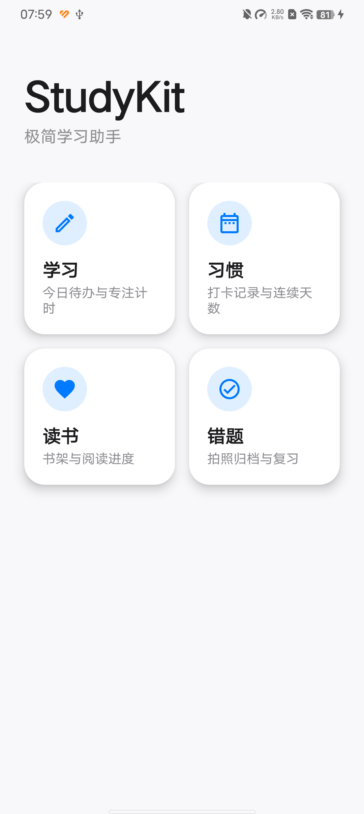

## ✨ Overview

StudyKit is an all-in-one learning assistant for students and self-learners, built on the v2 "warm paper" dual-theme token system (colors, typography and motion are all dispatched from `ui/theme` and `ui/motion`), which replaces the v1 iOS-style single-theme minimalist tokens. The app runs completely offline, with no network requests or account system. All data is stored locally in a Room database — your privacy is fully protected.

- Day/night dual themes and high-frame-rate interaction motion: a warm-paper light palette and a warm-black dark palette switch automatically with the system, while card flips, check-ins and session results all run on spring animations that follow 90/120Hz refresh rates frame by frame

## 📦 Four Core Modules

### 📚 Study Module (Vocabulary / Quizzes)
- **Word cards**: A flashcard learning mode showing the word on the front and its definition on the back, with "know it / don't know it" markers and automatic tracking of mastery status
- **Question bank practice**: A quiz mode with multiple-choice questions, instant scoring and answer explanations; wrong answers are automatically added to the mistake notebook
- **Study home**: An overview of today's study progress and cumulative statistics

### ✅ Habit Tracking Module
- **Habit management**: Create habits (name, frequency, target count) with completed-count tracking
- **Check-in calendar**: View check-in history by month, with support for making up missed days
- **Completion reminders**: Daily check-in reminders via WorkManager + notifications (check-in and counting interactions inspired by the "Xiao Ji Hua" app)

### 📖 Reading Notes Module
- **Bookshelf management**: Add books (title, author, cover image, total pages); covers support local image selection (loaded with Coil)
- **Reading progress**: Record your current page, with automatic reading percentage calculation
- **Note taking**: Archive reading notes by book, with per-book note list viewing

### ❌ Mistake Collection Module
- **Mistake collection**: Automatically collected from question bank practice, with manual addition also supported (question, my answer, correct answer, explanation)
- **Mistake details**: View full question information and explanations, with a "mastered" marker
- **Export and share**: Export the mistake notebook as a text file for easy printing and review (an improved feature)

### 📅 Calendar Enhancement
- A global calendar view aggregating study tasks, habit check-ins, and reading records
- View a detailed breakdown of all study events for any given day

## ⚡ Batch input (new in v2.1)

Adding entries one by one was the most off-putting part of this app, so v2.1 turns "add one" into "dump a batch":

| Entry point | How | Notes |
| --- | --- | --- |
| Paste | Word list / question bank → "Bulk import" | One item per line; tabs, commas, double spaces and a single space are all recognised as column separators, third column optional as example |
| File | Same screen → "Choose file" | txt / csv and friends; BOM and CRLF handled, same parsers as paste |
| Online dictionaries | Word list → "Library" | 81 public word lists, searchable, with per-book progress; each import becomes a list you can **undo as a whole** |
| Screenshot to words | Word list → "Screenshot to words" | Pick a "one word per line" screenshot, OCR feeds the preview screen |
| Photo OCR | Mistakes → capture → "Extract text from image" | First line becomes the title, the rest the note; **still editable**, nothing is saved automatically |

All four sources share one "preview → import → result" flow: the preview lets you tick rows out,
broken lines go to a "needs fixing" area with a reason, and **nothing is dropped silently**.
OCR uses ML Kit's bundled Chinese model — **fully offline, no Google Play Services required**
(works on devices such as vivo without GMS).

Word list data comes from the open-source repository [kajweb/dict](https://github.com/kajweb/dict)
and is for personal study only; after import everything is offline and this app uploads nothing.

## 🛠 Tech Stack

| Technology | Purpose |
| --- | --- |
| Kotlin | Development language |
| Jetpack Compose + Material3 | Declarative UI |
| Room | Local database (study plans, habits, books, mistakes, and other entities) |
| Navigation Compose | Bottom navigation and page routing |
| WorkManager | Scheduled check-in reminder tasks |
| Coil | Cover image loading |
| ML Kit text-recognition (Chinese, bundled) | Offline OCR for screenshots and photos; native libs kept for ARM ABIs only, APK ≈ 33.7 MB |
| androidx.profileinstaller + hand-written baseline profile | Install-time AOT pre-compilation of the startup chain and first-frame hot paths (rules in `app/src/main/baseline-prof.txt`; the CI release job asserts they are packaged as `assets/dexopt/baseline.prof*` in the APK) |
| Kotlin Coroutines + StateFlow | Coroutine-based async and reactive state management (the app has no preference storage; all UI state is driven by StateFlow) |

Build environment: JDK 17+ / Gradle 8.11 / AGP 8.7.3, with `compileSdk 35` and `minSdk 26`.

## 📁 Project Structure

```
StudyKit/
├── app/
│   └── src/main/
│       ├── java/com/studykit/
│       │   ├── data/                 # Data layer
│       │   │   ├── dao/              #   Room DAO
│       │   │   ├── entity/           #   Database entities
│       │   │   └── repository/       #   Repository layer
│       │   ├── receiver/             # Broadcast receivers (reminders)
│       │   ├── ui/                   # UI layer (Compose)
│       │   │   ├── book/             #   Reading notes
│       │   │   ├── habit/            #   Habit tracking
│       │   │   ├── mistake/          #   Mistake collection
│       │   │   ├── study/            #   Study (words / question bank)
│       │   │   ├── components/       #   Shared components
│       │   │   ├── nav/              #   Navigation
│       │   │   ├── motion/           #   Motion specs (MotionSpec springs)
│       │   │   └── theme/            #   Theme (v2 warm-paper dual-theme tokens)
│       │   ├── util/                 # Utilities
│       │   └── worker/               # WorkManager reminder tasks
│       ├── baseline-prof.txt         # Hand-written baseline profile (ART text rules)
│       └── res/                      # Resources
├── docs/
│   └── screenshots/                  # Screenshots (from real devices)
├── gradle/wrapper/                   # Gradle Wrapper
├── build.gradle.kts                  # Root build script
└── settings.gradle.kts
```

## 🚀 Build and Install

### Requirements
- JDK 17 or higher
- Android SDK (compileSdk 35)
- A real device / emulator running Android 8.0 (API 26) or higher

### Build
```powershell
# Windows
.\gradlew.bat assembleDebug
```
```bash
# macOS / Linux
./gradlew assembleDebug
```

The build output is located at `app/build/outputs/apk/debug/app-debug.apk`.

### Install to a Device
```bash
adb install app/build/outputs/apk/debug/app-debug.apk
```

## ⬇️ Download

> Don't want to build it yourself? You can download the packaged APK directly and install it on your Android phone.

| Channel | Link / Code | Notes |
| --- | --- | --- |
| Quark Netdisk | Code: `/~23753aU0cK~:/`, link: [https://pan.quark.cn/s/fce8a561b5b9?pwd=5Q3h](https://pan.quark.cn/s/fce8a561b5b9?pwd=5Q3h) | Access code `5Q3h`; open the Quark app and paste the entire code to get the file |
| Lanzou Cloud | [https://www.ilanzou.com/s/h5bKvvNR?code=4449](https://www.ilanzou.com/s/h5bKvvNR?code=4449) | Just open the link to download |

## 📸 Screenshots

> All screenshots below were taken on real devices.

### First Launch and Installation

| | |
|:---:|:---:|
|  |  |

### Study Module (Vocabulary / Quizzes)

| | | |
|:---:|:---:|:---:|
| 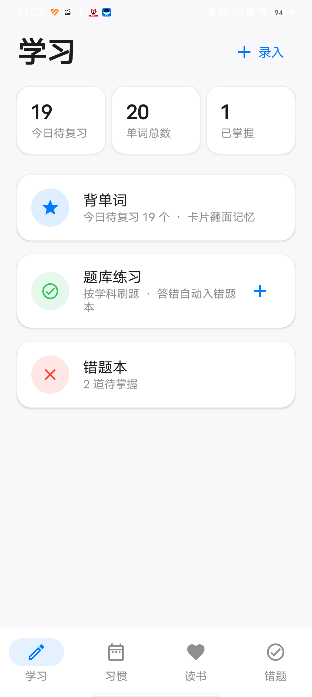 | 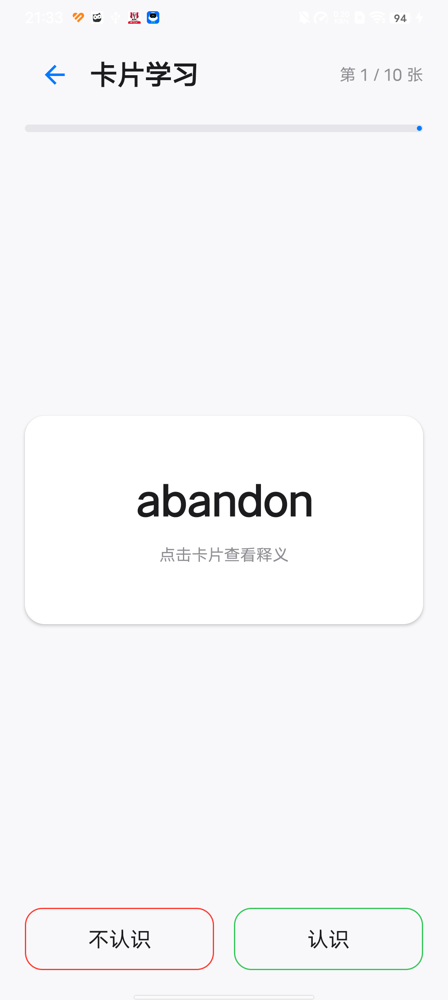 | 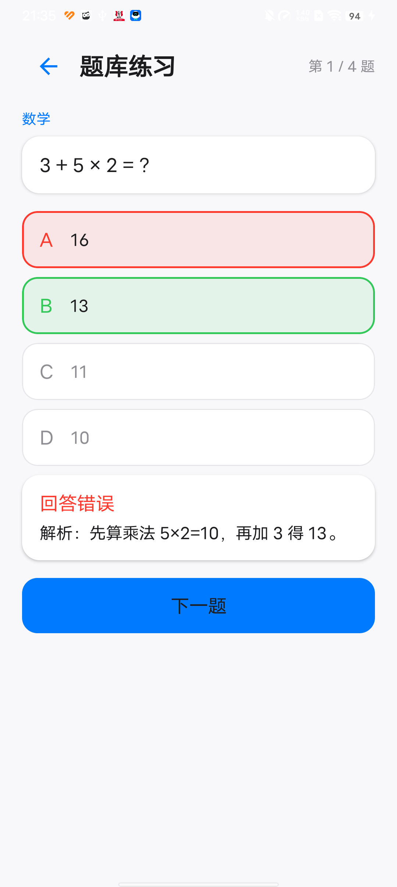 |
| 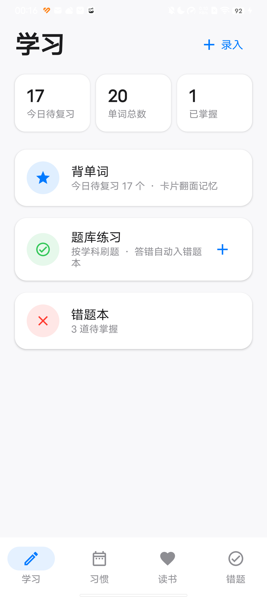 |  | |

### Habit Tracking Module

| | | |
|:---:|:---:|:---:|
|  |  | 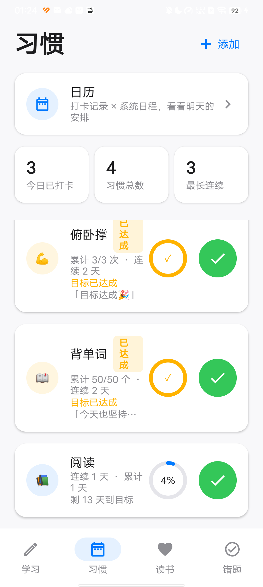 |
|  |  |  |

### Reading Notes Module

| | | |
|:---:|:---:|:---:|
|  |  | 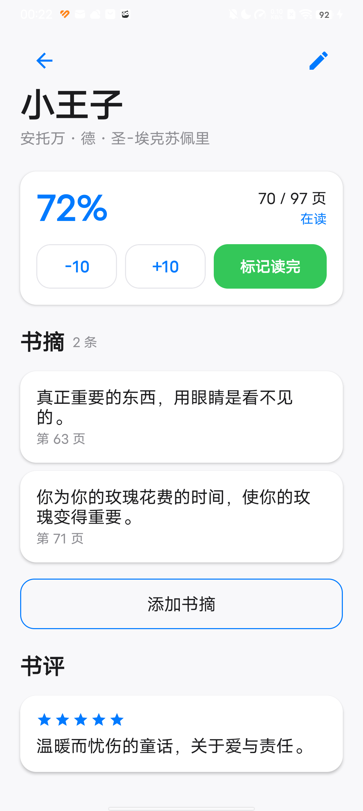 |

### Mistake Collection Module

| | | |
|:---:|:---:|:---:|
| 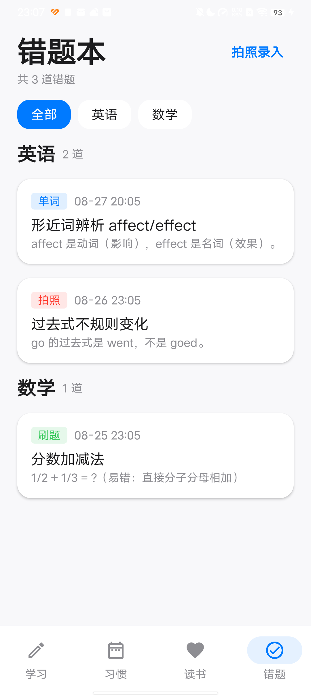 |  |  |
| 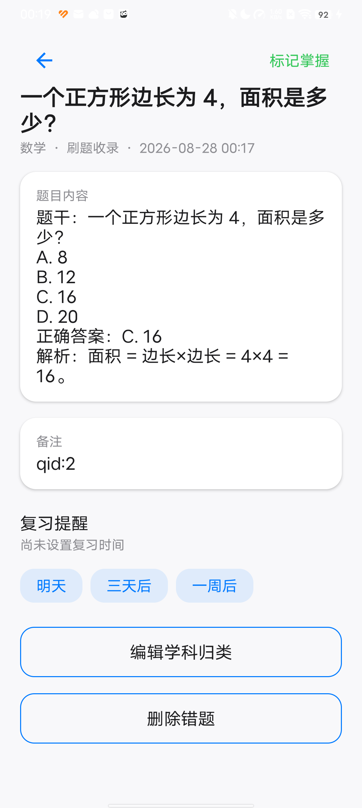 |  | |

### Calendar Enhancement

| | | |
|:---:|:---:|:---:|
| 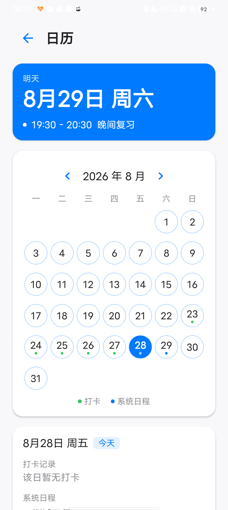 |  | 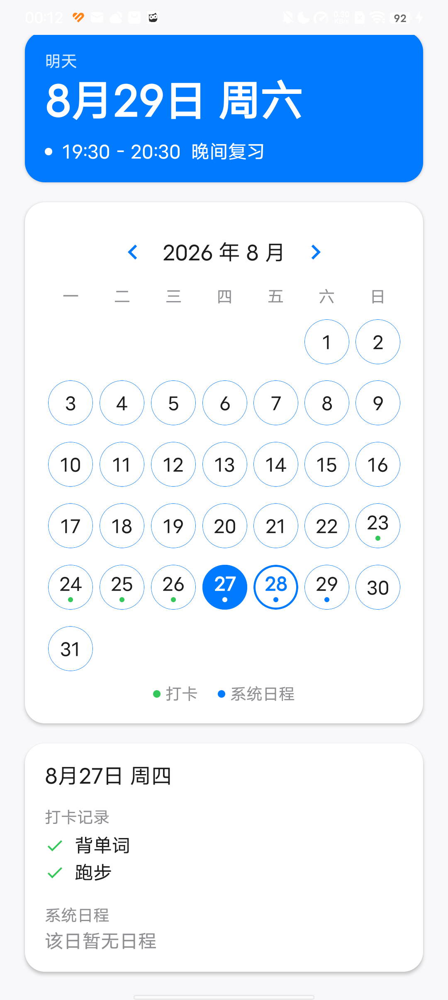 |

### Data Storage

| |
|:---:|
|  |

## 🙏 Acknowledgements

Some feature interactions were inspired by the "Xiao Ji Hua" (Little Plan) app (com.bakira.plan). Special thanks to its developers.

## 📄 License

This project is open-sourced under the [MIT License](LICENSE).
