# StudyKit 学习助手

> 一款纯本地存储的安卓学习管理应用：背单词 / 刷题、习惯打卡、读书笔记、错题整理，四大模块 + 日历视图增强，所有数据都保存在你自己的手机上。


## ✨ 应用简介

StudyKit 是一款面向学生和自学者的一站式学习助手，采用 iOS 风格的极简设计语言，遵循「清晰、顺从、深度」的设计原则。应用完全离线运行，无任何网络请求与账号体系，所有数据通过 Room 数据库保存在本地，隐私无忧。

## 📦 四大功能模块

### 📚 学习模块（背单词 / 刷题）
- **单词卡片**：翻卡学习模式，正面展示单词、背面显示释义，支持「认识 / 不认识」标记，自动记录掌握状态
- **题库练习**：选择题刷题模式，即时判分与答案解析，错题自动归入错题本
- **学习首页**：今日学习进度、累计学习统计一览

### ✅ 习惯打卡模块
- **习惯管理**：创建习惯（名称、频率、目标次数），支持已完成次数计数
- **打卡日历**：按月份查看打卡历史，当日补卡支持
- **完成提醒**：通过 WorkManager + 通知提醒每日打卡（借鉴「小计划」的补卡与计数交互）

### 📖 读书笔记模块
- **书架管理**：添加书目（书名、作者、封面图、总页数），封面支持本地图片选择（Coil 加载）
- **阅读进度**：记录当前页码，自动计算阅读百分比
- **笔记记录**：按书目归档读书笔记，支持书内笔记列表查看

### ❌ 错题整理模块
- **错题收集**：从题库练习自动收集，也支持手动添加（题目、我的答案、正确答案、解析）
- **错题详情**：查看完整题目信息与解析，支持「已掌握」标记
- **导出分享**：错题本可导出为文本文件，方便打印复习（借鉴改进功能）

### 📅 日历增强
- 全局日历视图聚合展示学习任务、习惯打卡与阅读记录
- 支持按日查看当天所有学习事件的明细

## 🛠 技术栈

| 技术 | 用途 |
| --- | --- |
| Kotlin | 开发语言 |
| Jetpack Compose + Material3 | 声明式 UI |
| Room | 本地数据库（学习计划、习惯、书籍、错题等实体） |
| Navigation Compose | 底部导航与页面路由 |
| WorkManager | 定时打卡提醒任务 |
| Coil | 封面图片加载 |
| DataStore | 轻量偏好设置存储 |

构建环境：JDK 17+ / Gradle 8.11 / AGP 8.7.3，`compileSdk 35`、`minSdk 26`。

## 📁 项目结构

```
StudyKit/
├── app/
│   └── src/main/
│       ├── java/com/studykit/
│       │   ├── data/                 # 数据层
│       │   │   ├── dao/              #   Room DAO
│       │   │   ├── entity/           #   数据库实体
│       │   │   └── repository/       #   仓库层
│       │   ├── receiver/             # 广播接收器（提醒）
│       │   ├── ui/                   # 界面层（Compose）
│       │   │   ├── book/             #   读书笔记
│       │   │   ├── habit/            #   习惯打卡
│       │   │   ├── mistake/          #   错题整理
│       │   │   ├── study/            #   学习（单词/题库）
│       │   │   ├── components/       #   通用组件
│       │   │   ├── nav/              #   导航
│       │   │   └── theme/            #   主题（iOS 极简风格令牌）
│       │   ├── util/                 # 工具类
│       │   └── worker/               # WorkManager 提醒任务
│       └── res/                      # 资源文件
├── gradle/wrapper/                   # Gradle Wrapper
├── build.gradle.kts                  # 根构建脚本
└── settings.gradle.kts
```

## 🚀 构建与安装

### 环境要求
- JDK 17 或更高
- Android SDK（compileSdk 35）
- Android 8.0（API 26）及以上真机 / 模拟器

### 构建
```powershell
# Windows
.\gradlew.bat assembleDebug
```
```bash
# macOS / Linux
./gradlew assembleDebug
```

产物位于 `app/build/outputs/apk/debug/app-debug.apk`。

### 安装到设备
```bash
adb install app/build/outputs/apk/debug/app-debug.apk
```

## 📸 运行截图

> 以下截图均为真机实测截图。

### 首次启动与安装

| | |
|:---:|:---:|
|  | 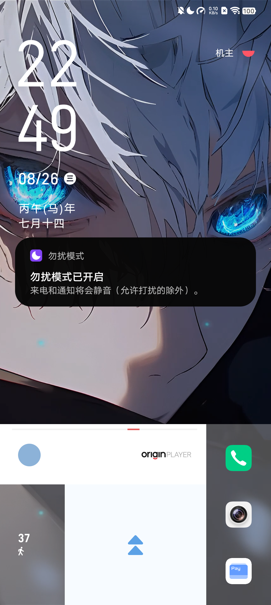 |

### 学习模块（背单词 / 刷题）

| | | |
|:---:|:---:|:---:|
|  |  |  |
|  | 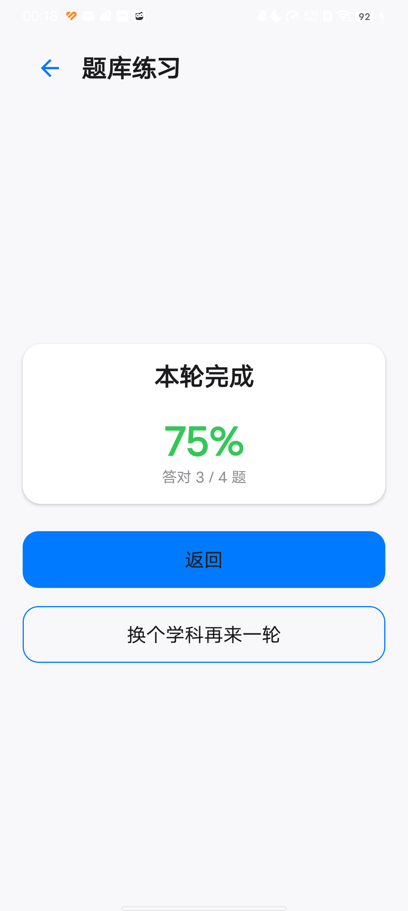 | |

### 习惯打卡模块

| | | |
|:---:|:---:|:---:|
| 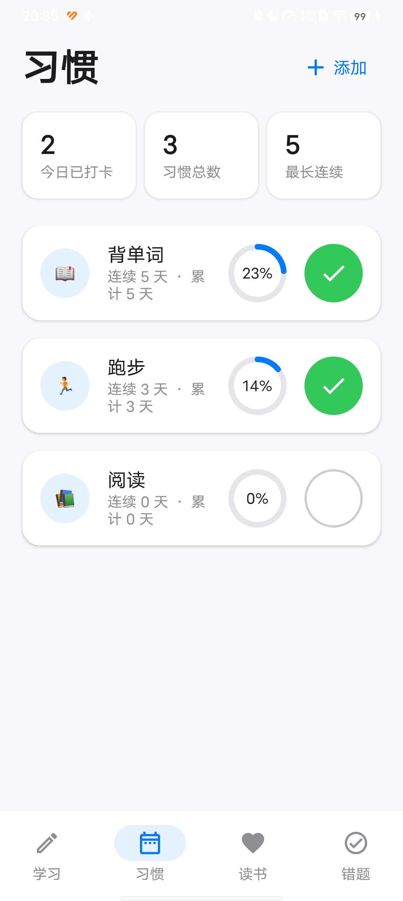 | 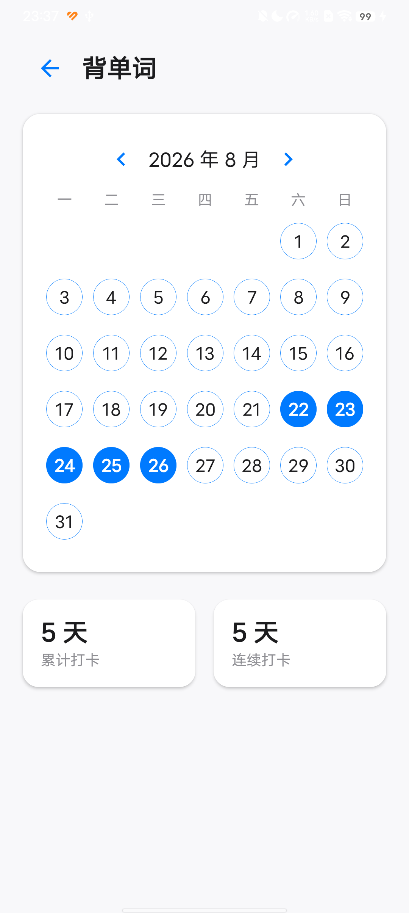 |  |
| 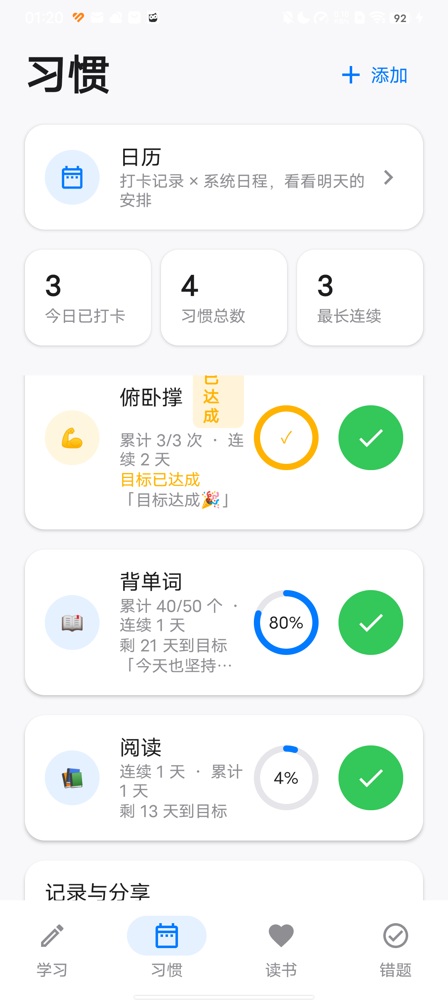 | 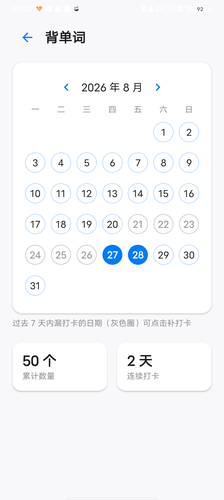 | 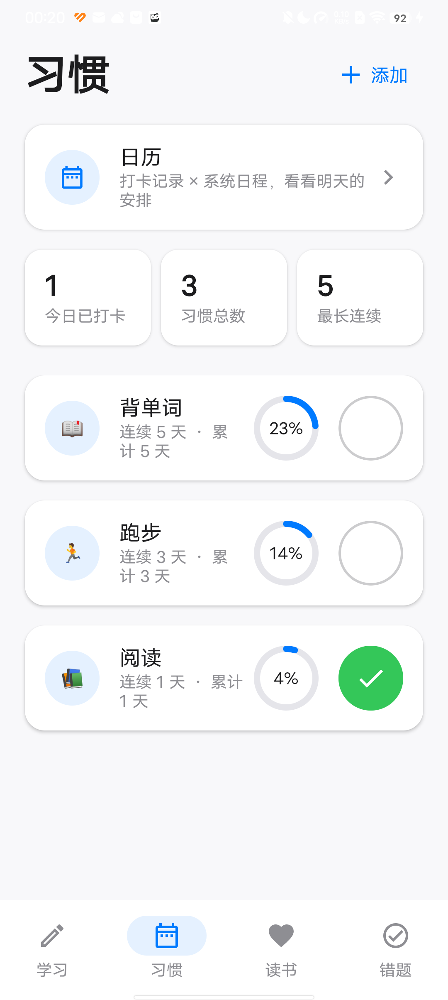 |

### 读书笔记模块

| | | |
|:---:|:---:|:---:|
| 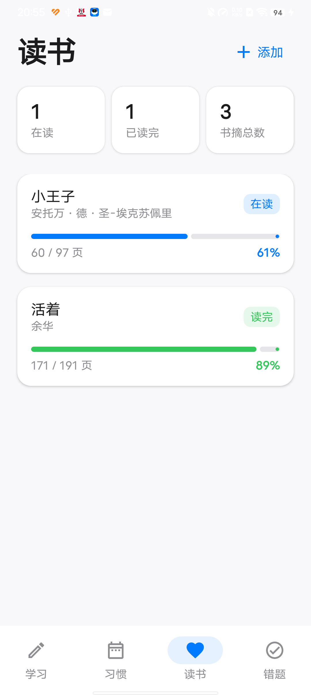 |  |  |

### 错题整理模块

| | | |
|:---:|:---:|:---:|
|  | 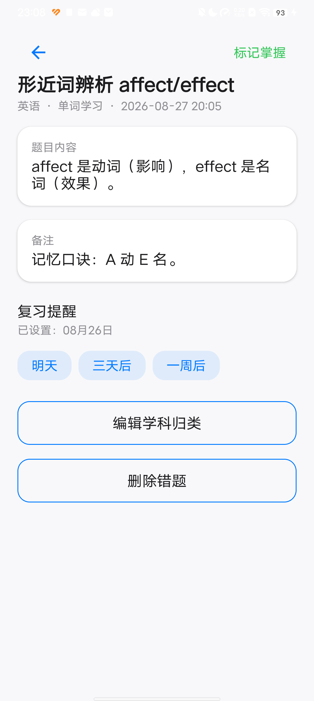 | 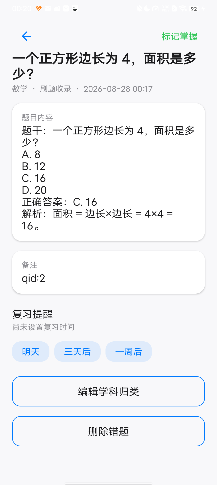 |
|  | 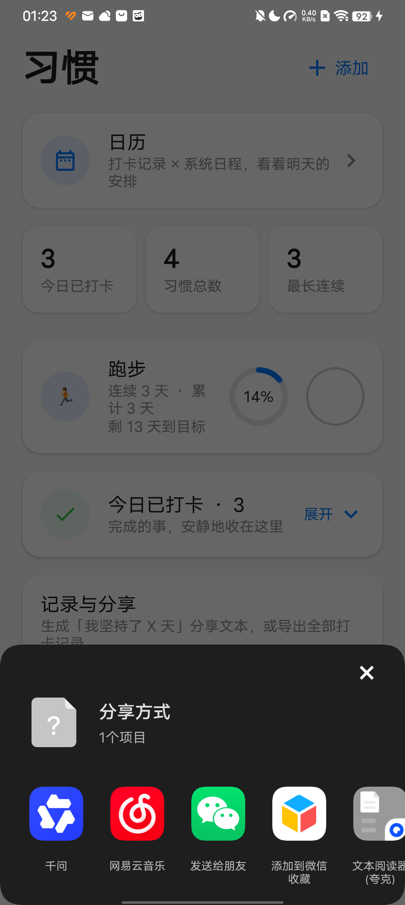 | |

### 日历增强

| | | |
|:---:|:---:|:---:|
|  | 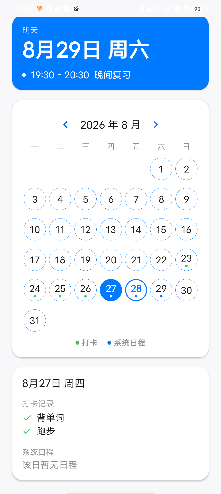 |  |

### 数据存储

| |
|:---:|
| 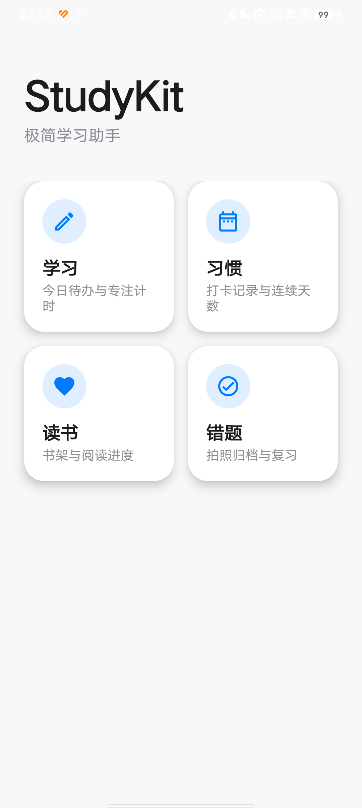 |

## 🙏 致谢

部分功能交互参考了「小计划」应用（com.bakira.plan），特此致谢。

## 📄 开源许可

本项目基于 [MIT License](LICENSE) 开源。
