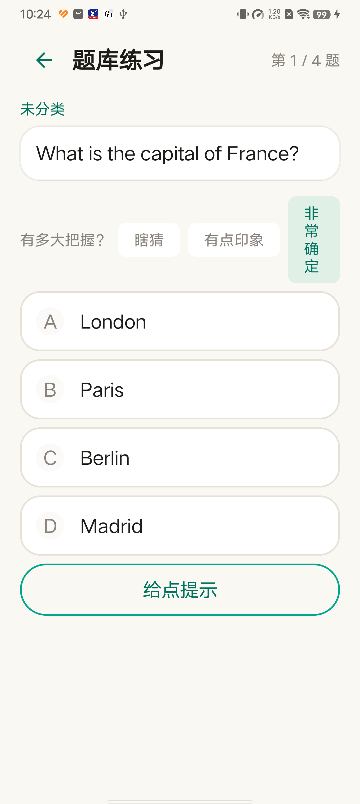
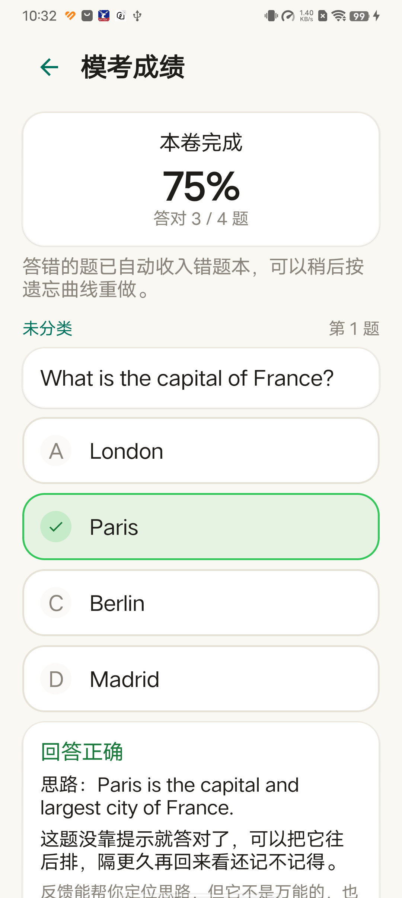
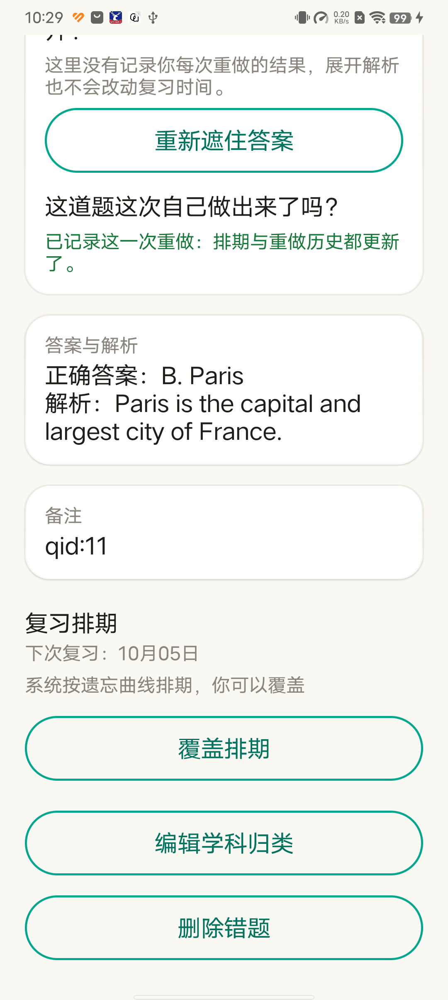
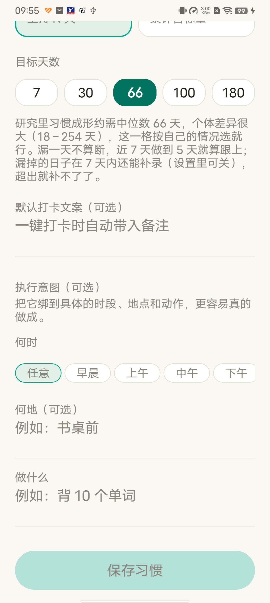
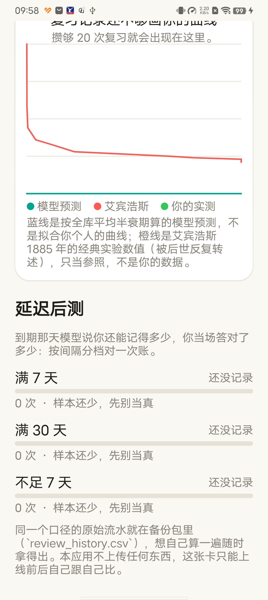

# StudyKit 学习助手

[简体中文](README.md) | [English](README.en.md) | [Русский](README.ru.md)


> 一款纯本地存储的安卓学习管理应用：背单词 / 刷题、习惯打卡、读书笔记、错题整理，四大模块 + 日历视图增强，所有数据都保存在你自己的手机上。

## ✨ 应用简介

StudyKit 是一款面向学生和自学者的一站式学习助手，设计语言为 v2 的「暖纸感」双主题令牌体系（配色、排版、动效统一由 `ui/theme` 与 `ui/motion` 下发），已不再沿用 v1 的 iOS 风格单主题极简令牌。**学习数据完全本地**：单词、打卡、契约、错题全部写在手机上的 Room 数据库里，不上传、不同步、没有账号体系。需要联网的只有两件事，且都可以不用：「在线词库」下载第三方词表、以及启动时查一次有没有新版本。

- 日/夜双主题与高帧率交互动效：浅色暖纸 / 夜间暖黑两套令牌随系统自动切换，翻卡、打卡、结算全程 spring 驱动，逐帧跟随 90/120Hz 刷新率

## 📦 四大功能模块

### 📚 学习模块（背单词 / 刷题）
- **单词卡片**：翻卡学习模式，正面展示单词、背面显示释义，翻面后自评「认识 / 模糊 / 忘记」三档，自动记录掌握状态。默认开启「先回忆再评分」—— 答案还没露出来时，滑动只帮你翻面、不算评分（设置里可关）
- **题库练习**：选择题刷题模式，即时判分与答案解析，错题自动归入错题本。多学科时默认**交错**打散（单学科不硬打散）；作答前可逐档要**提示**（线索 → 第一步 → 方法方向，三档都不给答案），答错才摊开完整解析；反馈分任务级 / 过程级 / 自我调节级三层
- **学习首页**：今日学习进度、累计学习统计一览；另有「明天预计复习 N 词 · 到时候大约还记得 X%」的记忆看板
- **科学小贴士**：在对应时刻（首次高置信答错、漏一天、连续 21 天、新词第一次露面…）给一句反直觉但站得住的结论，每条附证据来源并以 `[科学验证]` 徽标呈现；事件对不上就不提示

### ✅ 习惯打卡模块
- **习惯管理**：创建习惯（名称、频率、目标次数），支持已完成次数计数；目标天数默认 66 天（习惯自动化研究中位数，不是「21 天」）
- **打卡日历**：按月份查看打卡历史，过往日期补卡支持；列表与详情并列「连续天数」与「近 7 天 x/7」双指标，漏一天只算 6/7 不等于破功
- **完成提醒**：通过 WorkManager + 通知提醒每日打卡（借鉴「小计划」的补卡与计数交互）

### 📖 读书笔记模块
- **书架管理**：添加书目（书名、作者、封面图、总页数），封面支持本地图片选择（Coil 加载）
- **阅读进度**：记录当前页码，自动计算阅读百分比
- **笔记记录**：按书目归档读书笔记，支持书内笔记列表查看

### ❌ 错题整理模块
- **错题收集**：从题库练习自动收集，也支持手动添加（题目、我的答案、正确答案、解析）
- **错题详情**：默认**遮住答案与解析**，先自己重做一遍再对照（检索练习优于再看一遍解析）；展开后信息零丢失，并给一条三问式自我解释提示；复习时间仍由你自己定
- **导出分享**：错题本可导出为文本文件，方便打印复习（借鉴改进功能）

### 📅 日历增强
- 全局日历视图聚合展示学习任务、习惯打卡与阅读记录
- 支持按日查看当天所有学习事件的明细

## ⚡ 批量录入（v2.1 新增）

逐条手打是这个应用最劝人的地方，所以 v2.1 把「加一条」改成「倒一批」：

| 入口 | 怎么用 | 说明 |
| --- | --- | --- |
| 批量粘贴 | 单词库 / 题库 →「批量导入」→ 贴文本 | 一行一条；Tab、逗号、两个空格、单空格四种分列自动识别，第三列可选作例句 |
| 文件导入 | 同上页面 →「选文件」 | 选 txt / csv 等文本文件，BOM 与 CRLF 自动处理，与粘贴共用同一套解析 |
| 在线词库 | 单词库 →「词库」 | 81 本公开词表可搜可下载，带进度；导入后成为一本可**整本撤销**的词库 |
| 截图取词 | 单词库 →「截图取词」 | 选一张「一行一词」的截图，OCR 后直接进预览 |
| 拍照识别 | 错题本 → 拍照录入 →「从图片提取文字」 | 首行当标题、其余进备注，**仍可编辑**，不自动保存 |

四条来源共用同一套「预览 → 导入 → 结果」：预览页逐行可勾选剔除，坏行进「待修正」区并说明原因，
**不会静默丢行**；结果页给出成功 / 重复跳过 / 待修正，后两类都能展开看逐条明细。
OCR 用 ML Kit 的 bundled 中文模型，**全离线、不需要 Google 服务**（vivo 等无 GMS 机型可直接用）。

词表数据来自开源仓库 [kajweb/dict](https://github.com/kajweb/dict)，仅用于个人学习；导入后完全离线，本应用不上传任何数据。

## 🛠 技术栈

| 技术 | 用途 |
| --- | --- |
| Kotlin | 开发语言 |
| Jetpack Compose + Material3 | 声明式 UI |
| Room | 本地数据库（学习计划、习惯、书籍、错题等实体） |
| Navigation Compose | 底部导航与页面路由 |
| WorkManager | 定时打卡提醒任务 |
| Coil | 封面图片加载 |
| ML Kit text-recognition（Chinese, bundled） | 截图 / 拍照离线 OCR；原生库只保留 ARM 两个 ABI，APK 约 33.7MB |
| androidx.profileinstaller + 手写 baseline profile | 安装期预编译启动链与首帧热路径（规则见 `app/src/main/baseline-prof.txt`，CI 的 release job 断言其已编入 APK 的 `assets/dexopt/baseline.prof*`） |
| Kotlin Coroutines + StateFlow | 协程异步与响应式状态管理（应用无偏好设置存储，全部 UI 状态由 StateFlow 驱动） |

构建环境：JDK 17+ / Gradle 8.11 / AGP 8.7.3，`compileSdk 35`、`minSdk 26`。

## 📁 项目结构

```
StudyKit/
├── app/
│   └── src/main/
│       ├── java/com/studykit/
│       │   ├── data/                 # 数据层
│       │   │   ├── dao/              #   Room DAO
│       │   │   ├── entity/           #   数据库实体
│       │   │   └── repository/       #   仓库层
│       │   ├── receiver/             # 广播接收器（提醒）
│       │   ├── ui/                   # 界面层（Compose）
│       │   │   ├── book/             #   读书笔记
│       │   │   ├── habit/            #   习惯打卡
│       │   │   ├── mistake/          #   错题整理
│       │   │   ├── study/            #   学习（单词/题库）
│       │   │   ├── components/       #   通用组件
│       │   │   ├── nav/              #   导航
│       │   │   ├── motion/           #   动效规格（MotionSpec spring 常量）
│       │   │   └── theme/            #   主题（v2 双主题暖纸色板令牌）
│       │   ├── util/                 # 工具类
│       │   └── worker/               # WorkManager 提醒任务
│       ├── baseline-prof.txt         # 手写 baseline profile（ART 文本规则）
│       └── res/                      # 资源文件
├── docs/
│   └── screenshots/                  # 运行截图（真机实测）
├── gradle/wrapper/                   # Gradle Wrapper
├── build.gradle.kts                  # 根构建脚本
└── settings.gradle.kts
```

## 🚀 构建与安装

### 环境要求
- JDK 17 或更高
- Android SDK（compileSdk 35）
- Android 8.0（API 26）及以上真机 / 模拟器

### 构建
```powershell
# Windows
.\gradlew.bat assembleDebug
```
```bash
# macOS / Linux
./gradlew assembleDebug
```

产物位于 `app/build/outputs/apk/debug/app-debug.apk`。

### 安装到设备
```bash
adb install app/build/outputs/apk/debug/app-debug.apk
```

## ⬇️ 下载

> 不想自行构建？可直接下载已打包的安装包（APK），安装到安卓手机即可使用。

| 渠道 | 链接 / 口令 | 说明 |
| --- | --- | --- |
| 夸克网盘 | [https://pan.quark.cn/s/b1029385f1b5?pwd=z4Yk](https://pan.quark.cn/s/b1029385f1b5?pwd=z4Yk) | 提取码 `z4Yk`；这是一个**文件夹**分享，以后每版的 APK 都放进同一个目录，收藏这一条就够 |
| 蓝奏云 | [https://www.ilanzou.com/s/qzGr5dNn](https://www.ilanzou.com/s/qzGr5dNn) | 那里放的是 **`.7z` 压缩包**，下完要先解压才能装；想要裸 APK 用上面的夸克网盘 |
| GitHub Releases | [https://github.com/wuliao00/StudyKit/releases](https://github.com/wuliao00/StudyKit/releases) | 每次发版的原始 APK。国内直连不稳，优先用上面两个渠道 |

## 🚦 首次启动会看到什么

1. **免责声明（必须同意）**：写明这个应用真实存在的边界 —— 数据只在本机、卸载或清除数据会丢、
   在线词库来自第三方镜像、截图取词不保证正确、提醒可能被省电策略延迟。
   点「不同意并退出」会直接退出应用。**这份声明带版本号**：以后改条款会再征求一次同意。
2. **六页引导（可跳过）**：第一页是「从这里开始」三步（① 先把词装进来 ② 再建一个习惯
   ③ 想逼自己一把就签一份契约），之后是学习 / 习惯 / 自我契约 / 读书与错题 / 数据，
   每页三行讲清那个模块能做什么。
3. **之后随时可回看**：「设置 → 关于与支持」里有**使用教程**（与首启引导同一份内容）、
   **免责声明**、**源码仓库**入口，以及当前版本与「检查更新」。

> 启动时会静默检查一次新版本：读的是 **Gitee 仓库的 tags 接口**（不读 GitHub，那边国内直连不稳）。
> 检测到更新的版本会要求先更新再使用，「去下载」打开的是**夸克网盘**那一页；
> **取不到版本号一律放行** —— 没网、被限流、解析失败都当作"无需升级"，
> 不会因为一次网络抖动把人锁在门外。


## 📸 运行截图

> 这一组是 **v2.7.0 在一台 vivo 真机上实测拍下的**（对 2.5.0 覆盖升级之后拍的，不是模拟器、不是摆拍）。
> v2.7 把排期内核换成 FSRS，并加上信心自评、模考、错题排期接管、执行意图与延迟后测卡——
> 前五张逐个对应这些新面；第六张（检索式书摘）因为本轮验收发现的 opt-in 缺陷没能拍到，末尾如实记下。

**信心评级 + 超纠正**：翻面后、评分前三档自评（瞎猜 / 有点印象 / 非常确定），背词、题库练习、书摘共用这一行。



**模考（延迟反馈）**：选学科一次组卷，作答期间零对错反馈，交卷后才逐题摊开解析与三层反馈。



**错题排期接管**：下次复习由活跃内核写回，手动选期降级成「覆盖排期」。



**执行意图**：习惯创建页的「何时 · 何地 · 做什么」可选区块与整句实时预览。



**延迟后测卡**：统计页按 7d / 30d / 其他分桶对比实测与预测保留率，样本不足时明写「先别当真」。



**检索式书摘（记 N/A，未拍到）**：本轮真机验收发现书摘复习队列没有「纳入复习」的入口——
`setExcerptEnrolled(true)` 在生产代码里没有 UI 调用点，新书摘落库 `next_review_at=0`，永远进不了复习队列，
复习页只剩空态。`v27_excerpt_review.png` 因此空缺，待补一条录入侧的纳入复习路径后重拍（详见 CHANGELOG「没做 / 缺陷」）。

## 🙏 致谢

部分功能交互参考了「小计划」应用（com.bakira.plan）与「作业帮」，**仅借鉴功能形态、未使用其任何代码**，特此致谢。

## 📄 开源许可

本项目基于 [MIT License](LICENSE) 开源。
