# StudyKit 学习助手


> 纯本地存储的安卓学习应用：背单词 / 刷题、习惯打卡、读书笔记、错题整理。
> v1.1 起，复习排期由 FSRS 间隔重复算法调度，交互默认逼出主动回忆——所有数据仍然只保存在你自己的手机上。

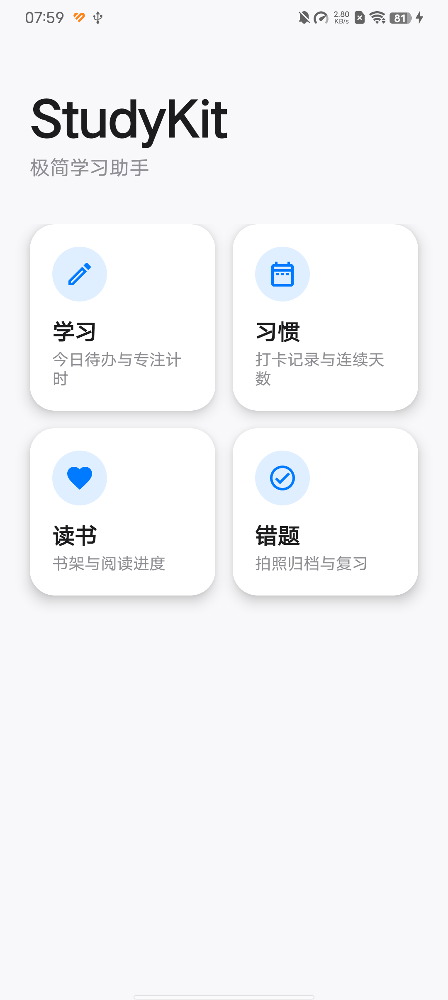

## ✨ 应用简介

StudyKit 是一款面向学生和自学者的一站式学习助手，采用 iOS 风格的极简设计语言，遵循「清晰、顺从、深度」的设计原则。应用完全离线运行，无任何网络请求与账号体系，所有数据通过 Room 数据库保存在本地，隐私无忧。

## 📦 四大功能模块

### 📚 学习模块（背单词 / 刷题）
- **检索优先的卡片流程**：新词先猜释义（预测试效应）→ 强制回忆并自评信心 → 翻面给答案 →
  Again / Hard / Good / Easy 四档评分，排期交给 FSRS
- **记忆看板**：今日到期、明日预计复习量、整体预测保留率，外加 14 天平均遗忘曲线
- **题库练习**：作答前自评信心；多学科交错混排（默认开）；解析按「线索 → 第一步 → 方法方向」
  三档挤牙膏揭示，用完三档才给完整解析；反馈分任务级 / 过程级 / 自我调节级三层
- **错题自动归集**：答错即入错题本，高置信答错的条目排期更紧、队列优先级更高

### ✅ 习惯打卡模块
- **执行意图**：创建习惯必填「何时 + 何地 + 做什么」，附 5 套模板与习惯叠加提示
- **弹性连续**：目标天数默认 66 天（习惯自动化的研究中位数），达标看周达标率 5/7，
  每月 2 张断签保护卡，跨月自动回血；漏一天不清零、不背锅
- **打卡与日历**：按月份查看历史、过往日期补卡（消耗保护卡）、全局日历聚合
- **完成提醒**：WorkManager 周期任务 + 本地通知（补卡与数量计数交互借鉴「小计划」）

### 📖 读书笔记模块
- **检索式笔记**：读完先合书回忆（精加工提问模板），对照原文后三档自评，自评结果参与间隔排期
- **书摘入复习队列**：书摘按间隔曲线再次被检索，不再只是攒着
- **指标纠偏**：书架与详情展示「检索练习次数」而非「书摘总数」，并明确进度百分比不等于理解程度
- **书架管理**：书目、封面（Coil）、当前页码与阅读百分比

### ❌ 错题整理模块
- **重做式复习**：默认遮住解析，先自己重做一遍再对照；重做记录写入 `mistake_reviews`
- **错因归因**：概念不清 / 计算失误 / 审题偏差 / 记忆模糊，各带自我解释提示
- **算法掌握判定**：跨间隔连续答对 2 次才转「已掌握」，同一天连对两次不算
- **排期策略**：默认自动排期，用户手动钉住某天时算法让位
- **导出分享**：错题本与打卡记录可导出，方便打印复习

### 📅 日历增强
- 全局日历视图聚合学习任务、习惯打卡与阅读记录，支持按日查看明细

## 🧠 学习科学依据

界面与排期的每条设计都对应一个可查证的结论，而不是产品直觉。主要依据：

| 结论 | 来源 | 在应用里的落点 |
| --- | --- | --- |
| 主动回忆优于重复阅读 | Roediger & Karpicke 2006；Karpicke & Blunt 2011, *Science*；Dunlosky et al. 2013 评为 high utility | 卡片先回忆再翻面；错题先重做再看解析 |
| 分布式练习有效，间隔应随目标保留期放大 | Cepeda et al. 2006, *Psychol. Bull.*；Murre & Dros 2015 独立复现遗忘曲线 | FSRS 逐条推算间隔，而非固定 +1/+3 天 |
| 交错练习利于辨别（中等效应） | Brunmair & Richter 2019；Kornell & Bjork 2008 | 题库多学科混排，并提示「觉得更难是正常的」 |
| 错误 + 反馈优于回避错误；高置信错误纠正后记得最牢 | Metcalfe 2011 / 2017；Butler 2011（不重测会回弹） | 信心自评、超纠正优先级与更紧的重测间隔 |
| 反馈有效但效应量约 d=0.48 | Wisniewski, Zierer & Hattie 2020（修正早期 0.79） | 反馈分三层给出，但不暗示单靠反馈就能学会 |
| 习惯自动化中位数约 66 天（18–254），偶尔漏做不影响养成 | Lally et al. 2010, *EJSP* | 目标 66 天、周达标率 5/7、断签保护卡 |
| 执行意图（if-then）d≈0.65 | Gollwitzer & Sheeran 2006 | 创建习惯必填何时/何地/做什么 |
| 预测试效应：猜错也增强后续学习 | Kornell, Hays & Bjork 2009 | 新词先猜释义 |
| 目标梯度：越接近目标越努力 | Kivetz, Urminsky & Zheng 2006 | 第 N 天 / 目标天数与阶段文案 |
| 学习风格无证据 | Pashler et al. 2008 | 因此**没有**做「学习风格个性化」功能 |

未采信的部分：FSRS 相对传统算法「省 20%~30% 时间」是来源资料的说法，本仓库未独立复现；
来源资料中关于承诺契约的一条文献状态未能核实，相关功能（押金 / 监督人）因此没有实现。

## 🛠 技术栈

| 技术 | 用途 |
| --- | --- |
| Kotlin | 开发语言 |
| Jetpack Compose + Material3 | 声明式 UI |
| Room | 本地数据库（v3，FSRS 记忆状态与复习记录随实体落库） |
| FSRS v4（自研实现，无第三方依赖） | 间隔重复调度：`app/src/main/java/com/studykit/srs/` |
| Navigation Compose | 底部导航与页面路由 |
| WorkManager | 定时复习与打卡提醒 |
| Coil | 封面图片加载 |
| Kotlin Coroutines + StateFlow | 协程异步与响应式状态管理 |

构建环境：JDK 17+ / Gradle 8.11 / AGP 8.7.3，`compileSdk 35`、`minSdk 26`。

## 📁 项目结构

```
StudyKit/
├── app/
│   └── src/main/
│       ├── java/com/studykit/
│       │   ├── data/                 # 数据层
│       │   │   ├── dao/              #   Room DAO
│       │   │   ├── entity/           #   数据库实体
│       │   │   └── repository/       #   仓库层
│       │   ├── receiver/             # 广播接收器（提醒）
│       │   ├── ui/                   # 界面层（Compose）
│       │   │   ├── book/             #   读书笔记
│       │   │   ├── habit/            #   习惯打卡
│       │   │   ├── mistake/          #   错题整理
│       │   │   ├── study/            #   学习（单词/题库）
│       │   │   ├── components/       #   通用组件
│       │   │   ├── nav/              #   导航
│       │   │   └── theme/            #   主题（iOS 极简风格令牌）
│       │   ├── util/                 # 工具类
│       │   └── worker/               # WorkManager 提醒任务
│       └── res/                      # 资源文件
├── docs/
│   └── screenshots/                  # 运行截图（真机实测）
├── gradle/wrapper/                   # Gradle Wrapper
├── build.gradle.kts                  # 根构建脚本
└── settings.gradle.kts
```

## 🚀 构建与安装

### 环境要求
- JDK 17 或更高
- Android SDK（compileSdk 35）
- Android 8.0（API 26）及以上真机 / 模拟器

### 构建
```powershell
# Windows
.\gradlew.bat assembleDebug
```
```bash
# macOS / Linux
./gradlew assembleDebug
```

产物位于 `app/build/outputs/apk/debug/app-debug.apk`。

### 安装到设备
```bash
adb install app/build/outputs/apk/debug/app-debug.apk
```

## ⬇️ 下载

> 不想自行构建？可直接下载已打包的安装包（APK），安装到安卓手机即可使用。

| 渠道 | 链接 / 口令 | 说明 |
| --- | --- | --- |
| 夸克网盘 | 口令：`/~23753aU0cK~:/`，链接：[https://pan.quark.cn/s/fce8a561b5b9?pwd=5Q3h](https://pan.quark.cn/s/fce8a561b5b9?pwd=5Q3h) | 提取码 `5Q3h`；打开夸克 APP 粘贴整段口令内容即可获取 |
| 蓝奏云 | [https://www.ilanzou.com/s/h5bKvvNR?code=4449](https://www.ilanzou.com/s/h5bKvvNR?code=4449) | 直接打开链接下载即可 |

## 📸 运行截图

> 下列截图为 v1.0.0 真机实测。v1.1 的检索优先卡片、记忆看板、重做式错题、执行意图与合书回忆等
> 新界面尚未重新跑真机截图，完成后会补充到本节（算法与排期逻辑已有 216 条 JVM 单测覆盖）。

### 首次启动与安装

| | |
|:---:|:---:|
|  |  |

### 学习模块（背单词 / 刷题）

| | | |
|:---:|:---:|:---:|
|  | 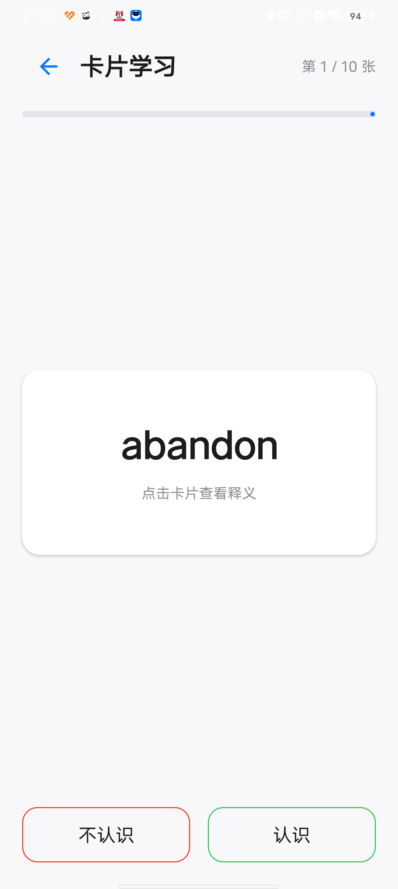 | 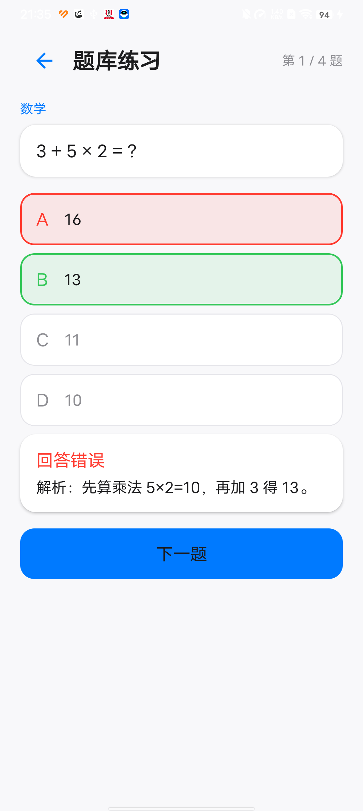 |
|  | 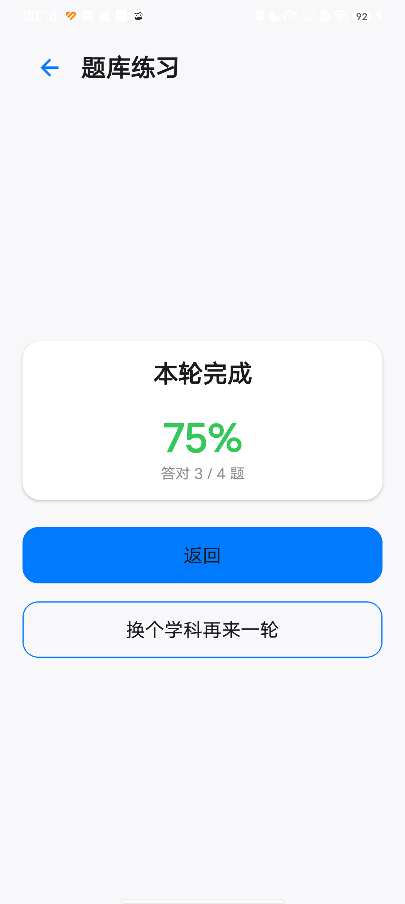 | |

### 习惯打卡模块

| | | |
|:---:|:---:|:---:|
| 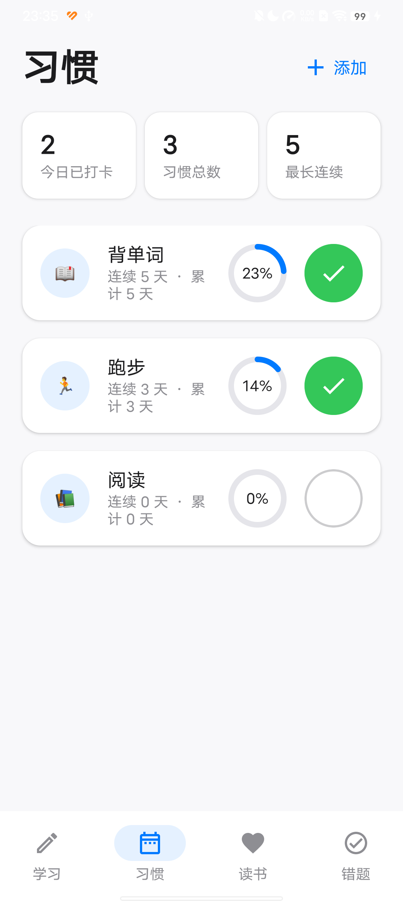 | 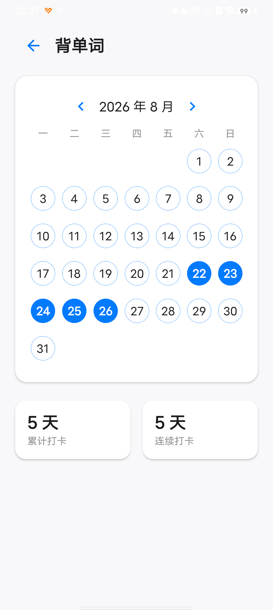 | 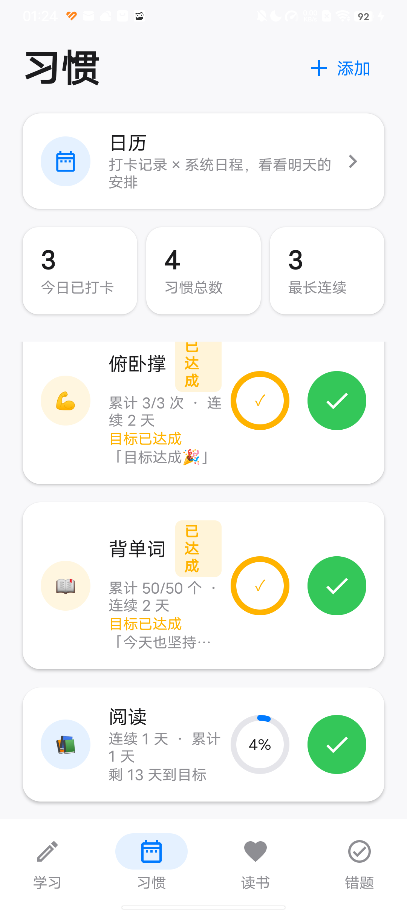 |
| 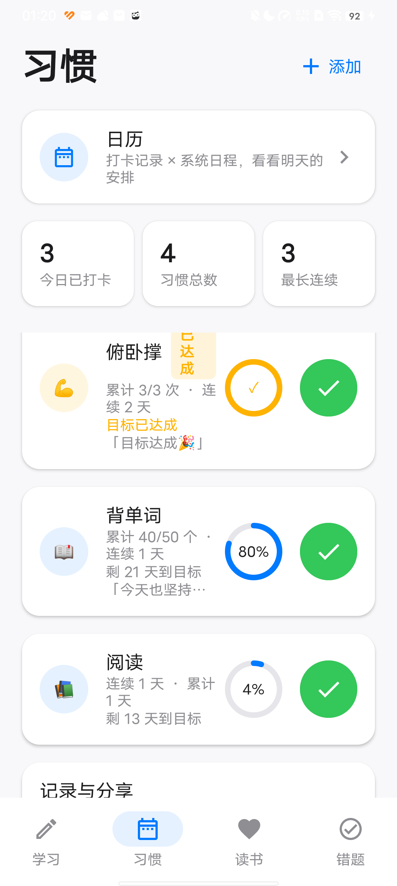 | 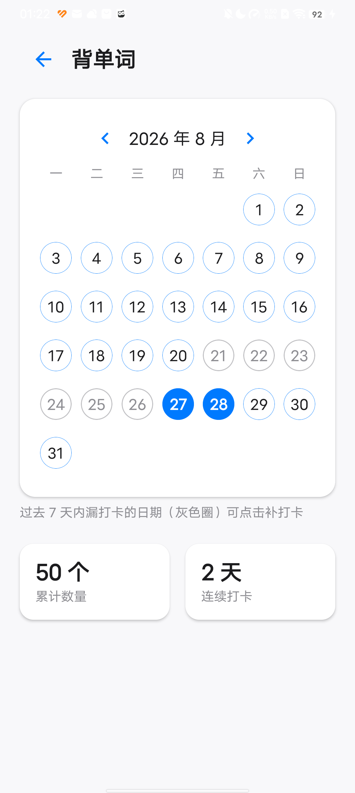 | 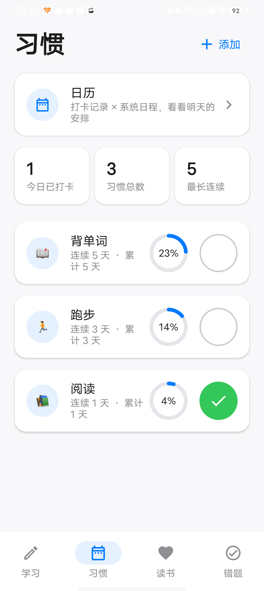 |

### 读书笔记模块

| | | |
|:---:|:---:|:---:|
| 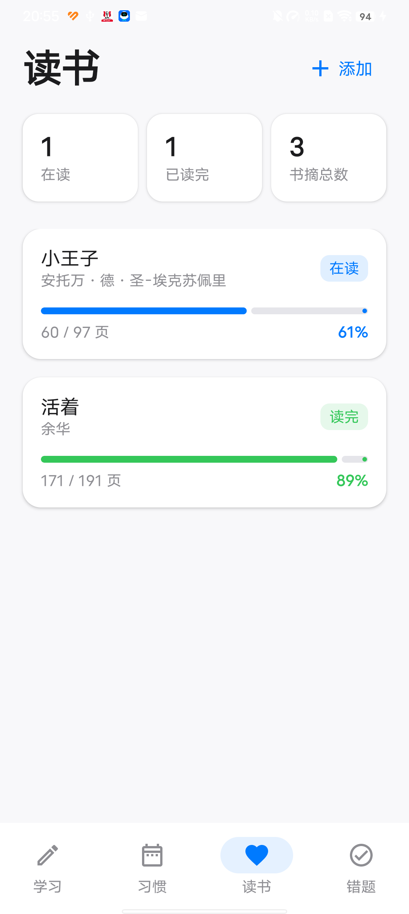 |  |  |

### 错题整理模块

| | | |
|:---:|:---:|:---:|
|  | 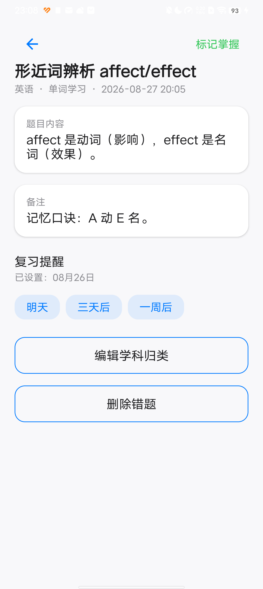 | 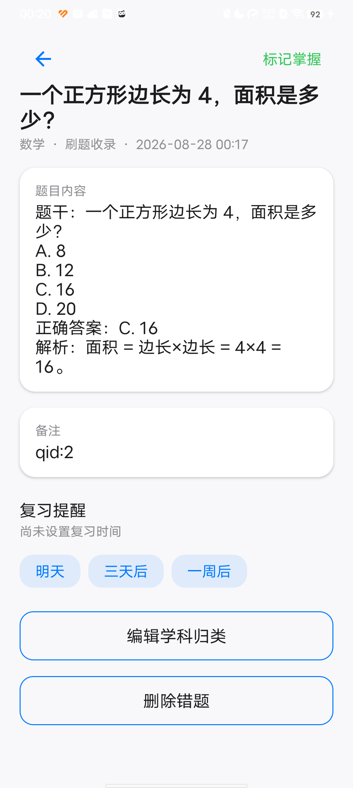 |
|  | 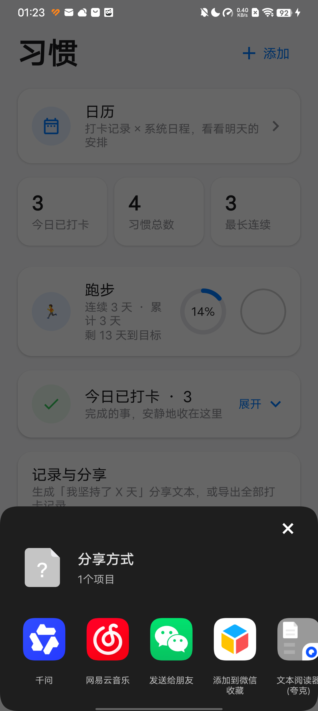 | |

### 日历增强

| | | |
|:---:|:---:|:---:|
|  |  |  |

### 数据存储

| |
|:---:|
| 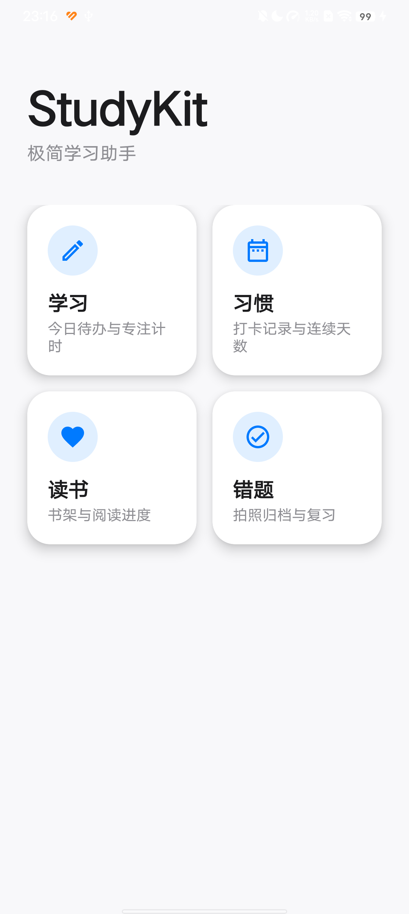 |

## 🚦 验证与自检

```powershell
# 单元测试（216 条，全为 JVM 纯逻辑）+ lint + Debug 构建
.\gradlew.bat :app:testDebugUnitTest :app:lintDebug :app:assembleDebug
```

- **算法正确性**：`srs/FsrsTest` 用恒等式与单调性卡住 FSRS 实现（R(t=S)=90%、目标保留率 0.9 时间隔等于稳定性、
  成功复习不降低稳定性、Easy > Good > Hard、过期复习增益更大）。
- **升级安全**：`tools/check_migration.py` 以 Room 自己生成的建表 SQL 为基准，离线比对
  「v2 库 + MIGRATION_2_3」与「v3 全新建表」的表/列/主键/默认值/索引/外键：

  ```powershell
  python tools\check_migration.py <v2生成目录> <v3生成目录>
  ```

  v2 基准可用 `git worktree add <目录> v1.0.0` + `:app:kspDebugKotlin` 生成。
- **API 级别**：lint 的 NewApi 会拦住 `LocalDate.ofInstant`（需 API 34）这类误用，
  日期换算请统一走 `com.studykit.util.Time`。

## 🙏 致谢

部分功能交互参考了「小计划」应用（com.bakira.plan），特此致谢。

## 📄 开源许可

本项目基于 [MIT License](LICENSE) 开源。
