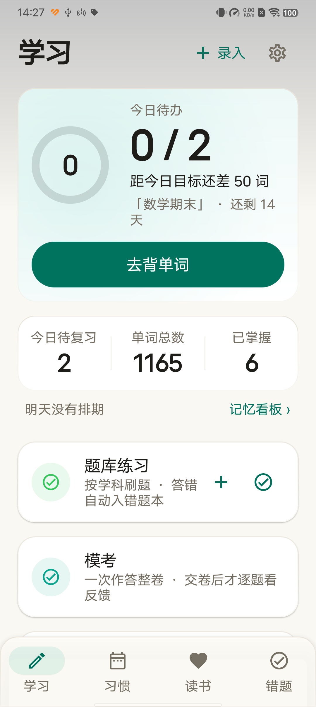
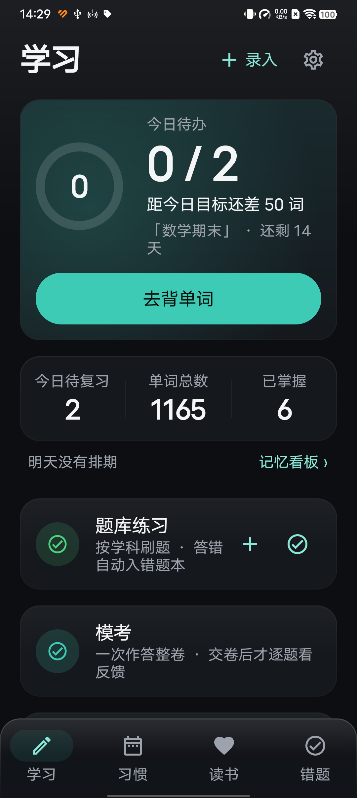
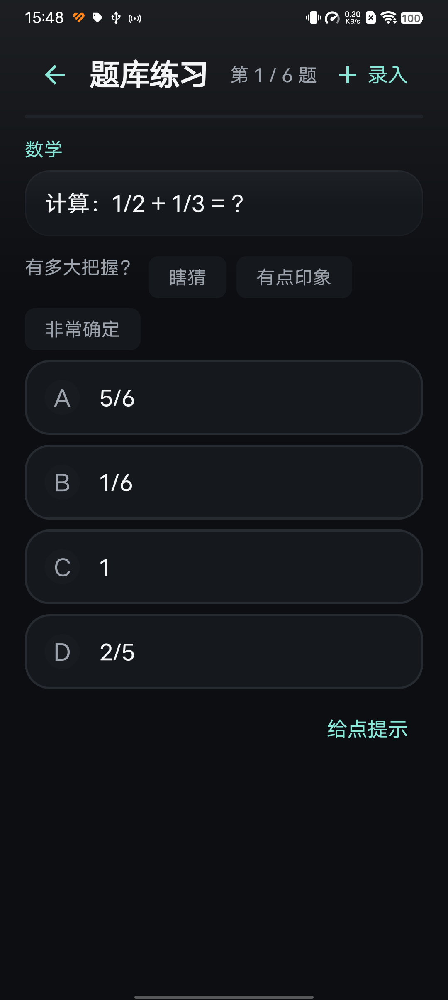
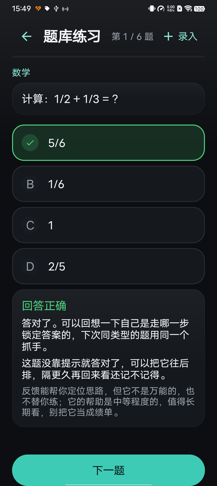

# StudyKit 学习助手

[简体中文](README.md) | [English](README.en.md) | [Русский](README.ru.md)


> 一款纯本地存储的安卓学习管理应用：背单词 / 刷题、学习设计、习惯打卡、读书笔记、错题整理，五大模块 + 日历视图增强，所有数据都保存在你自己的手机上。

## ✨ 应用简介

StudyKit 是一款面向学生和自学者的一站式学习助手，设计语言为 v2 的「暖纸感」双主题令牌体系（配色、排版、动效统一由 `ui/theme` 与 `ui/motion` 下发），已不再沿用 v1 的 iOS 风格单主题极简令牌。**学习数据完全本地**：单词、打卡、契约、错题全部写在手机上的 Room 数据库里，不上传、不同步、没有账号体系。需要联网的只有两件事，且都可以不用：「在线词库」下载第三方词表、以及启动时查一次有没有新版本。

- 日/夜双主题与高帧率交互动效：浅色暖纸 / 夜间暖黑两套令牌随系统自动切换，翻卡、打卡、结算全程 spring 驱动，逐帧跟随 90/120Hz 刷新率

## 📦 五大功能模块

### 📚 学习模块（背单词 / 刷题）
- **单词卡片**：翻卡学习模式，正面展示单词、背面显示释义，翻面后自评「认识 / 模糊 / 忘记」三档，自动记录掌握状态。默认开启「先回忆再评分」—— 答案还没露出来时，滑动只帮你翻面、不算评分（设置里可关）
- **题库练习**：选择题刷题模式，即时判分与答案解析，错题自动归入错题本。多学科时默认**交错**打散（单学科不硬打散）；作答前可逐档要**提示**（线索 → 第一步 → 方法方向，三档都不给答案），答错才摊开完整解析；反馈分任务级 / 过程级 / 自我调节级三层。v3.5 起每轮 10 题**优先出最久没练过的**：练完一轮这批题就沉到队尾，下一轮自然轮到后面的题，60 道的题包不会被同一批 10 道堵住
- **学习首页**：今日学习进度、累计学习统计一览；另有「明天预计复习 N 词 · 到时候大约还记得 X%」的记忆看板
- **记忆引擎（排期内核）**：默认 FSRS v6（21 参数），翻面评分后由它排出下一次复习；可选手动切回半衰期旧内核（仅维护）。v2.9.0 起可选**端侧个性化校准**——用你自己的复习记录把这 21 个参数重训一遍，过硬/软门槛才换核。**校准全程在本机完成、记录不出设备**；后台只在**充电 + 空闲**时干跑出报告（不自动换核），是否采用新曲线由你在「设置 → 排期内核」里点
- **科学小贴士**：在对应时刻（首次高置信答错、漏一天、连续 21 天、新词第一次露面…）给一句反直觉但站得住的结论，每条附证据来源并以 `[科学验证]` 徽标呈现；事件对不上就不提示

### ✅ 习惯打卡模块
- **习惯管理**：创建习惯（名称、频率、目标次数），支持已完成次数计数；目标天数默认 66 天（习惯自动化研究中位数，不是「21 天」）
- **打卡日历**：按月份查看打卡历史，过往日期补卡支持；列表与详情并列「连续天数」与「近 7 天 x/7」双指标，漏一天只算 6/7 不等于破功
- **完成提醒**：通过 WorkManager + 通知提醒每日打卡（借鉴「小计划」的补卡与计数交互）

### 📖 读书笔记模块
- **书架管理**：添加书目（书名、作者、封面图、总页数），封面支持本地图片选择（Coil 加载）
- **阅读进度**：记录当前页码，自动计算阅读百分比
- **笔记记录**：按书目归档读书笔记，支持书内笔记列表查看

### ❌ 错题整理模块
- **错题收集**：从题库练习自动收集，也支持手动添加（题目、我的答案、正确答案、解析）
- **错题详情**：默认**遮住答案与解析**，先自己重做一遍再对照（检索练习优于再看一遍解析）；展开后信息零丢失，并给一条三问式自我解释提示；复习时间仍由你自己定
- **导出分享**：错题本可导出为文本文件，方便打印复习（借鉴改进功能）

### 🧭 学习设计模块（v3.4）
- **8 种模板**：费曼学习、习题带练、学会学习、互动工作坊、系列课规划、逆向教学设计、核心素养备课、螺旋式课程设计
- **结构化生成**：每种模板有独立字段与实时 Markdown 预览；填什么写什么，不调用模型、断网可用
- **可带走**：方案存本地，可继续编辑、整份复制、系统分享；转屏/进程回收后草稿不丢
- **依据可查**：每张模板卡写明方法论出处（费曼技巧、波利亚四阶段、Dunlosky 2013、Kolb、Wiggins & McTighe、核心素养、Bruner），不写没有落点的“研究表明”

### 📅 日历增强
- 全局日历视图聚合展示学习任务、习惯打卡与阅读记录
- 支持按日查看当天所有学习事件的明细

## ⚡ 批量录入（v2.1 新增）

逐条手打是这个应用最劝人的地方，所以 v2.1 把「加一条」改成「倒一批」：

| 入口 | 怎么用 | 说明 |
| --- | --- | --- |
| 批量粘贴 | 单词库 / 题库 →「批量导入」→ 贴文本 | 一行一条；Tab、逗号、两个空格、单空格四种分列自动识别，第三列可选作例句 |
| 文件导入 | 同上页面 →「选文件」 | txt / md / csv / docx / pdf；中文旧编码、Word 段落、PDF 文字层自动提取，扫描版 PDF 走端侧 OCR（前 20 页） |
| 题库商店 | 题库练习 →「题库商店 · 按阶段下载题包」 | 6 个原创题包共 332 题（每包 44~60 道），题包**在线优先**、缓存次之、内置兜底；卡片上标题型分布与本机已入库题数，逐包标来源与许可，下载后先预览再入库 |
| 链接导入 | 题库商店 →「从链接导入题包」 | 贴任意网站的题包文本地址（`https://…/包.txt`），不用对方提供目录，下载后同样先预览再入库 |
| 示例题库 | 批量录入题目 →「示例题库」 | 38 道原创题，覆盖 6 个阶段与 8 种题型；可自由修改，不包含真题 |
| 在线词库 | 单词库 →「词库」 | 81 本公开词表可搜可下载，带进度；导入后成为一本可**整本撤销**的词库 |
| 截图取词 | 单词库 →「截图取词」 | 选一张「一行一词」的截图，OCR 后直接进预览 |
| 拍照识别 | 错题本 → 拍照录入 →「从图片提取文字」 | 首行当标题、其余进备注，**仍可编辑**，不自动保存 |
| 拍照/相册录题 | 学习 / 题库 →「＋录入」→「拍照 / 相册录题」；错题本 →「拍照 / 相册」 | 现拍或从系统相册选一页题 → OCR；题库解析出条目就进预览，没分列就进编辑页，**不自动切错题本**；相册不需要存储权限 |

v2.7.0.1 起，学习首页与题库屏右上角那颗「＋录入」扩成了一个下拉菜单（录入单词 / 拍照 / 相册录题 / 批量录入题目 / 从词库导入）。
**已有的入口不重复摆**：单词库、错题本、书架不再加菜单（摘录批量入库在 schema 上还落不下，原因见 CHANGELOG）。

这几条来源共用同一套「预览 → 导入 → 结果」：预览页逐行可勾选剔除，坏行进「待修正」区并说明原因，
**不会静默丢行**；结果页给出成功 / 重复跳过 / 待修正，后两类都能展开看逐条明细。
OCR 自 v2.8.0 起用 **PP-OCRv6**（经 ONNX Runtime Android 推理，模型 Apache-2.0），**全离线、不需要 Google 服务**（vivo 等无 GMS 机型可直接用）；此前用的 ML Kit bundled 中文模型（2024-08 后停更）已下线。真机对拍显示 PP-OCRv6 字级错误率约为 ML Kit 的一半（CER 0.106 vs 0.210），代价是更慢与包体增大（双 ABI 约 +56MB）。

> v3.6 起两个模型（检测 9.5 MB + 识别 20.3 MB）可以不在 APK 里：把 `app/src/main/assets/models/`
> 下的两个 `*_ppocrv6_small.onnx` 挪出去再 `assembleDebug`，精简包小 25.5 MB（94.3 MB vs 121.2 MB）。
> 首次识别前到「设置 → OCR 模型」下载（下载后本机运行、不上传）。默认构建仍内置，断网即用。
> 识别失败（缺库/内存不足/模型异常/模型未下载）都会降级为一条错误提示而非崩溃。

词表数据来自开源仓库 [kajweb/dict](https://github.com/kajweb/dict)，仅用于个人学习；导入后完全离线，本应用不上传任何数据。

## 🛠 技术栈

| 技术 | 用途 |
| --- | --- |
| Kotlin | 开发语言 |
| Jetpack Compose + Material3 | 声明式 UI |
| Room | 本地数据库（学习计划、习惯、书籍、错题等实体） |
| Navigation Compose | 底部导航与页面路由 |
| WorkManager | 定时打卡提醒任务 |
| Coil | 封面图片加载 |
| ONNX Runtime Android + PP-OCRv6 | 截图 / 拍照离线 OCR（v2.8.0 起取代 ML Kit）；保留 ARM 两个 ABI，debug APK 约 90MB |
| androidx.profileinstaller + 手写 baseline profile | 安装期预编译启动链与首帧热路径（规则见 `app/src/main/baseline-prof.txt`，CI 的 release job 断言其已编入 APK 的 `assets/dexopt/baseline.prof*`） |
| Kotlin Coroutines + StateFlow | 协程异步与响应式状态管理（应用无偏好设置存储，全部 UI 状态由 StateFlow 驱动） |

构建环境：JDK 17+ / Gradle 8.11 / AGP 8.7.3，`compileSdk 35`、`minSdk 26`。

## 📁 项目结构

```
StudyKit/
├── app/
│   └── src/main/
│       ├── java/com/studykit/
│       │   ├── data/                 # 数据层
│       │   │   ├── dao/              #   Room DAO
│       │   │   ├── entity/           #   数据库实体
│       │   │   └── repository/       #   仓库层
│       │   ├── receiver/             # 广播接收器（提醒）
│       │   ├── ui/                   # 界面层（Compose）
│       │   │   ├── book/             #   读书笔记
│       │   │   ├── habit/            #   习惯打卡
│       │   │   ├── mistake/          #   错题整理
│       │   │   ├── study/            #   学习（单词/题库）
│       │   │   ├── components/       #   通用组件
│       │   │   ├── nav/              #   导航
│       │   │   ├── motion/           #   动效规格（MotionSpec spring 常量）
│       │   │   └── theme/            #   主题（v2 双主题暖纸色板令牌）
│       │   ├── util/                 # 工具类
│       │   └── worker/               # WorkManager 提醒任务
│       ├── baseline-prof.txt         # 手写 baseline profile（ART 文本规则）
│       └── res/                      # 资源文件
├── docs/
│   └── screenshots/                  # 运行截图（真机实测）
├── gradle/wrapper/                   # Gradle Wrapper
├── build.gradle.kts                  # 根构建脚本
└── settings.gradle.kts
```

## 🚀 构建与安装

### 环境要求
- JDK 17 或更高
- Android SDK（compileSdk 35）
- Android 8.0（API 26）及以上真机 / 模拟器

### 构建
```powershell
# Windows
.\gradlew.bat assembleDebug
```
```bash
# macOS / Linux
./gradlew assembleDebug
```

产物位于 `app/build/outputs/apk/debug/app-debug.apk`。

### 安装到设备
```bash
adb install app/build/outputs/apk/debug/app-debug.apk
```

## ⬇️ 下载

> 不想自行构建？可直接下载已打包的安装包（APK），安装到安卓手机即可使用。

| 渠道 | 链接 / 口令 | 说明 |
| --- | --- | --- |
| 夸克网盘 | [https://pan.quark.cn/s/b1029385f1b5?pwd=z4Yk](https://pan.quark.cn/s/b1029385f1b5?pwd=z4Yk) | 提取码 `z4Yk`；**文件夹**分享，v3.4.1 的 `StudyKit-v3.4.1-debug.apk`（116 MB）与 `StudyKit-v3.4.1-debug.7z`（76.3 MB）已放进同一目录 |
| 蓝奏云 | [https://www.ilanzou.com/s/2HryJxHd](https://www.ilanzou.com/s/2HryJxHd) | v3.4.1 的 **`.7z` 压缩包**（79,990,219 B），永久有效、无提取码；下完要先解压才能装 |
| GitHub Releases | [https://github.com/wuliao00/StudyKit/releases](https://github.com/wuliao00/StudyKit/releases) | 每次发版的原始 APK 与 `.7z`。国内直连不稳，优先用上面两个渠道 |
| Gitee Releases | [https://gitee.com/wuliao11541/StudyKit/releases](https://gitee.com/wuliao11541/StudyKit/releases) | v3.4.1 与 v3.4.0 都已建发行版，附件是 **`.7z`**（Gitee 单附件上限 100 MB）；更新检查读的也是 Gitee tags |
| 123 云盘 | [https://1828156079.share.123pan.cn/123pan/w5lUjv-jGd3h?pwd=WiAW](https://1828156079.share.123pan.cn/123pan/w5lUjv-jGd3h?pwd=WiAW) | 提取码 `WiAW`；`StudyKit` 目录分享，3.4.1 的 APK 与 `.7z` 都在里面 |
| 百度网盘 | [https://pan.baidu.com/s/1zgokGo5eyFTX-_QavLu7cQ?pwd=b6pu](https://pan.baidu.com/s/1zgokGo5eyFTX-_QavLu7cQ?pwd=b6pu) | 提取码 `b6pu`；`StudyKit` 目录分享，同上 |

> **更新检查只走 Gitee**：App 启动时读 Gitee 仓库的 tags 判断版本；夸克、蓝奏云、GitHub Releases 只是下载渠道，不参与版本判断。

## 🚦 首次启动会看到什么

1. **免责声明（必须同意）**：写明这个应用真实存在的边界 —— 数据只在本机、卸载或清除数据会丢、
   在线词库来自第三方镜像、截图取词不保证正确、提醒可能被省电策略延迟。
   点「不同意并退出」会直接退出应用。**这份声明带版本号**：以后改条款会再征求一次同意。
2. **六页引导（可跳过）**：第一页是「从这里开始」三步（① 先把词装进来 ② 再建一个习惯
   ③ 想逼自己一把就签一份契约），之后是学习 / 习惯 / 自我契约 / 读书与错题 / 数据，
   每页三行讲清那个模块能做什么。
3. **之后随时可回看**：「设置 → 关于与支持」里有**使用教程**（与首启引导同一份内容）、
   **免责声明**、**源码仓库**入口，以及当前版本与「检查更新」。

> 启动时会静默检查一次新版本：读的是 **Gitee 仓库的 tags 接口**（不读 GitHub，那边国内直连不稳）。
> 检测到更新的版本会要求先更新再使用，「去下载」打开的是 **Gitee Releases** 页
> （发行版附件是 `.7z`，解压后安装；Gitee 单附件上限 100M）；
> **取不到版本号一律放行** —— 没网、被限流、解析失败都当作"无需升级"，
> 不会因为一次网络抖动把人锁在门外。


## 📸 运行截图

> 这一组是 **v2.7.0 在一台 vivo 真机上实测拍下的**（对 2.5.0 覆盖升级之后拍的，不是模拟器、不是摆拍）。
> v2.7 把排期内核换成 FSRS（**v2.8.0 升到真 FSRS v6**），并加上信心自评、模考、错题排期接管、执行意图与延迟后测卡——
> 前五张逐个对应这些新面。第六张（检索式书摘）本轮验收时因 opt-in 缺陷没能拍到，已在 **v2.7.0.1** 修复并补拍（末尾如实记下）。

**信心评级 + 超纠正**：翻面后、评分前三档自评（瞎猜 / 有点印象 / 非常确定），背词、题库练习、书摘共用这一行。


**模考（延迟反馈）**：选学科一次组卷，作答期间零对错反馈，交卷后才逐题摊开解析与三层反馈。


**错题排期接管**：下次复习由活跃内核写回，手动选期降级成「覆盖排期」。


**执行意图**：习惯创建页的「何时 · 何地 · 做什么」可选区块与整句实时预览。


**延迟后测卡**：统计页按 7d / 30d / 其他分桶对比实测与预测保留率，样本不足时明写「先别当真」。


**检索式书摘（v2.7.0.1 修复后补拍）**：v2.7.0 验收时发现的缺陷——新摘录落库 `next_review_at=0`、
永远进不了复习队列——已在 v2.7.0.1 修复：`addExcerpt` 按 spec §7.2 原口径默认填 `now + 1d`（建摘即入队、
明天第一次到期），每摘仍可在复习页 opt-out。**零 schema 变更**。下面两张都是那台 vivo 真机拍的：
在《博弈论》里用 app 自身「添加书摘」录一条真实摘录后，详情页书摘计数变 1（入队证据）；
因 `now+1d` 语义**今天不该到期**，复习页如实显示空态「没有到期的书摘 / 记下的书摘会自动排进复习队列」——
这正是修好后的行为，没有造假到期（真机 `run-as` 读库确认该行 `next_review_at = 保存时刻 + 86400000ms`）。


> 诚实缺口：`now+1d` 使复习卡在验收当天不可拍（要明天才到期），设备时钟不可改，
> 故拍到的是「入队证据 + 空态正确文案」而非复习卡本体。

### v2.8.0：排期内核升 FSRS v6 + OCR 下线 ML Kit

**FSRS v6**（无新截图，内核数学升级）：`FsrsKernel` 从简化 FSRS-5（固定 `decay=−0.5`）升到真 v6（21 参数、`decay` 可学习、新增 easy bonus 与 intra-day 短期稳定度）。黄金值逐值取自官方 py-fsrs 6.3.2（见 `docs/evidence/`，可复跑）。不声称与 Anki 逐比特一致。

**OCR 下线 ML Kit、PP-OCRv6 转正**：下图为那台 vivo 真机上，拍屏文字经 PP-OCRv6 识别后自动回填到「拍照录入」页的实拍（无 ML Kit）。纸面畸变照片未覆盖（本版无真实纸质样本），精度结论沿用研究阶段真机 A/B。

**录入菜单（v2.7.0.1）**：学习首页右上角的「＋录入」——一个菜单里给齐拍照录题、批量录入题目、从词库导入。
以下三张同样是那台 vivo 真机拍的（对 2.7.0 覆盖升级成 2.7.0.1，升级后单词总数仍是 1162，一条没丢）。


**拍照 / 相册录题**：菜单里点这一项先选「拍照」或「从相册选择」：拍照沿用错题那套
`TakePicture` 契约；相册走系统照片选择器（Android 13+ 是 Photo Picker，旧系统自动回退），
两条路都复制到 cache 后进同一个 OCR 管线，不新增存储权限。
拍完回来跑 OCR → 直接落进既有的预览屏。这一张拍的是墙面，没认出题目，于是只弹一句提示、不落库、人留在原地。


**导入结果页的账**：粘贴 3 个词走完全程，结果页写的是**真实条数**而不是 0（v2.7.0 那处回归的复验），
点「好」一次就回到进入前的那一屏。


### v2.9.0：端侧 FSRS 个性化校准

**校准卡（真机现状）**：验收机（ColorOS，arm64）上原先装着 2.5.0，而那一版是另一台构建机的 debug 钥匙签的（证书 `f86c8a85…` ≠ 本机 `1b9b054a…`），`adb install -r` 被系统判 `INSTALL_FAILED_UPDATE_INCOMPATIBLE`——按本仓既有发版口径先卸载再装 2.9.0，于是 `review_log` 是一张空表。设置页「排期内核」下方的校准卡如实落在“还差 1000 次评分就能校准”的数据不足态，「重新校准」置灰但不隐藏——不是摆拍，正是没有记录时的真实默认态（数据不够就不会去烧一次设备训练）。


**校准结果弹窗**：为了在缺少真实记录的验收机上端到端跑通这条链路，用 `-PseedSynth=true` 本地构建才出现的“灌合成数据(1500卡)”入口铺一份 `SynthLog` 合成复习记录（状态行随即变成“还在用通用曲线 · 满 1000 次评分后可校准”，入口同时收起），再点「重新校准」——端侧 `fsrsjni` 拟合几秒内跑完，弹出结果报告：**预测误差 0.374 → 0.368、校准曲线最大偏差 1.6%、预计平均间隔 71.6 天 → 65.7 天**，附 Canvas 画的预测 vs 实际散点。截图前点的是「先不改」：状态行仍停在“还在用通用曲线”、参数快照 0 份，**一次报告没有自己换过核**。真实 `review_log` 攒够后走的是同一条链路，数字换真。**注：这一张报告的底数据是合成的（非任何真实个体的记录），只验“链路能跑通并出报告”，不代表拟合质量。**


### v3.0.0：负荷预告与可视化 · 考试模式与照片遮挡 · 相似题打散

> **真机验证（2026-10-20 收尾）**：三条线的主要界面与覆盖升级已在 2026-10-16/17 于一台
> vivo V2156A / Android 11 上验过（首轮 19 张 + 本轮收尾 6 张实拍在 `docs/screenshots/`）；发版前又补验了 B5 后半段
> （拖两块遮挡 → REDO 遮住 → 点按全揭）、B6（无遮挡老照片 REDO 整张扣住 / CHECK 才露出）
> 与 500 题三档设备基准，读数见 `CHANGELOG.md` 的 `[3.0.0]` 段。
> 下面只是对代码现状的复述；逐条边界与「未做 / 未验」的账以 CHANGELOG `[3.0.0]` 段为准。

- **负荷预告与记忆可视化（v3.0-A）**：统计页 14 天负荷带（按当前排期状态反解逐日 `mean ± sd`）、
  提醒决策三档、稳定性全景分箱、52×7 复习热力图、单卡 R 曲线（曲线上的到期标记 ≡ 调度器会给的间隔，
  逐值机检）。
- **考试模式与图片遮挡（v3.0-B）**：按学科的考试清单与考前目标保留率 ramp（封顶 0.97）、套卷限时模拟
  （按「返回」=暂停保留、杀进程可续卷、到点自动交卷）、交卷后待批改队列、拍照错题的照片遮挡
  （拖拽画矩形/椭圆），并修掉拍照错题在重做阶段整张照片可见的印刷答案泄露（详情页与灯箱；错题本
  列表缩略图那一角仍是记了账没关上的洞）。
- **相似题打散（v3.0-C）**：设置页新增「相似题打散」开关——**默认关闭，不打开等于没这项功能**。打开后
  题库练习与综合练习会把**题面文字上就很像**的题尽量隔开：相邻的像题尽量拆，同一学科同考点的对子尽量
  隔 3~5 题再遇；成对出现时会在靠后的那张题上挂一行「这两张卡容易混，隔开放是故意的」。判据是题干文字
  与考点标签，**不是语义模型**（"意思相近但用词不同"的题看不见）、不联网、不装额外东西；阈值是未经
  标注校准的初值，真机基准未做——都在 CHANGELOG 已知边界里写着。
- 启动时的静默更新检查维持既有实现：读 **Gitee 仓库的 tags 接口**判版本、取不到版本号一律放行。
  这是代码事实的复述（本条不声称在真机上验过这次检查）。


### v3.4.1：使用教程图解

> 只更新使用教程，不改数据与功能；版本 `3.4.1 / 26`，Room 仍 v12。

- 「设置 → 使用教程」新增 4 张当前版本截图：设计 Tab、题库商店、下载预览、拍照/相册。
- 每张截图都画了橙色箭头；考试倒计时等个人信息用色块遮住并标注「隐私信息已隐藏」。
- 教程正文补「设计与题库（v3.4）」一页，覆盖 8 种模板、题库商店、txt/docx/pdf 导入与非选择题
  不再自动切错题本。
- 图解文档版见 [`docs/tutorial-v3.4.md`](docs/tutorial-v3.4.md)。

### v3.4.0：学习设计工作台 + 题库文件导入

> 新增第五个 Tab「设计」，以及题库文件的 txt/docx/pdf 导入。Room v11 → v12（只加 `design_plans` 表）。
> 仍然是纯本地：设计模板是**字段拼装**，不调用模型；导入的文件只留在本机。

- **8 种学习设计模板**：费曼学习、习题带练、学会学习、互动工作坊、系列课规划、逆向教学设计、
  核心素养备课、螺旋式课程设计。每种都有结构化字段、方法论依据、实时 Markdown 预览。
- **保存与带走**：方案存本地 Room，可继续编辑、整份复制、用系统分享发给别人；离开页面再回来
  草稿还在。生成的是可复现的模板文本，不是“AI 作文”。
- **题库商店**：题库练习页 →「题库商店 · 按阶段下载题包」，当前提供小学/初中/高中/大学/考研/考公
  6 个**原创示例包**、共 332 道题（小学 60 · 初中 60 · 高中 60 · 大学 56 · 考研 52 · 考公 44），
  卡片上直接标题型分布与本机已入库题数；每个包标出来源与许可，下载后先进预览、再入库。
  题包**在线优先**（manifest 里带 `url`，现在的地址是 jsDelivr 的 GitHub 镜像）、下载过一次后进本机缓存，
  APK 里的副本只作离线兜底；也可以「从链接导入题包」，贴任意网站的题包文本地址即可。
  只收纯文本、2 MB 上限、下载后先预览；真题包需自行取得授权再导入。
- **题库文件导入**：`.txt/.md/.csv` 自动识别 UTF-8/UTF-16/GB18030；`.docx` 还原段落；
  `.pdf` 先取文字层，扫描版回退到已有的 PP-OCRv6（最多 20 页，需核对）。`.doc/.wps` 会先看文件头：
  实际是 docx/zip 的直接读；真旧版二进制则提示另存。
- **Word 里的公式是 MathType 对象？** 这类卷子（学科网导出很常见）的公式存成
  `word/embeddings/oleObject*.bin` 二进制，文本层里一个字都没有。应用会把每处标成 `⟦公式⟧`
  并在导入页说明；想拿到真公式，先在电脑上转成 Word 原生公式再导入（原生公式会被还原成
  `$…$` 的 LaTeX，分数/根式/上下标都保留结构）：
  ```bash
  pip install lxml olefile python-docx
  git clone https://github.com/a917470154/mathtypejx && pip install ./mathtypejx
  python -c "from mathtypejx.cli import main; main(['convert','卷子.docx','-o','卷子_omml.docx'])"
  ```
  需要电脑上装了 Office（`MML2OMML.XSL` 随 Office 安装）。实测一份 1248 处公式的数学卷
  1248/1248 全部转换成功；导入转换后的 docx，题干里就是 `$\frac{7\pi}{6}$` 这种可读形式。
- **经典示例题库**：内置 38 道**原创**题，覆盖小学/初中/高中/大学/考研/考公与 8 种题型，点一下就能
  看到完整格式，再照着改。不内置任何真题；来源与授权边界见
  [`docs/question-bank-sources.md`](docs/question-bank-sources.md)，格式取舍见
  [`docs/import-boundaries.md`](docs/import-boundaries.md)。

### v3.3.0：题库阶段 × 题型 × 判分方式

> **这一版只扩题库**，单词/习惯/读书的数据与调度不变；Room v9 → v11，旧题自动落为「单选 · 未标注」。
> 不内置任何题库：应用只做元数据、筛选与本地导入（考试真题/解析有版权，国家智慧教育平台资源也
> 不得用于商业行为）。

- **阶段**：初中 / 高中 / 大学 / 考研 / 考公 / 未标注。阶段与学科正交（数学可出现在初中/高中/大学/考研；
  行测、申论是学科名，不是阶段）。
- **题型**：单选、多选、判断、填空、计算、简答、主观（论述/申论）、材料/案例。
  学科入口有「阶段 + 题型」两行筛选，两者都是筛选器、不级联；综合练习在双筛选后 ≥2 个学科时出现。
- **判分**：单选/多选/判断自动判；多选集合完全相等才算对，部分分只展示、不进 FSRS；
  填空/计算先做规范化 + 多答案比对，不命中再让用户自评；简答/主观/材料**只自评**，绝不假装自动判分。
  所有自评只写练习记录，不写 FSRS 校准流。
- **导入**：`[阶段·学科·题型]` 前缀，如
  `[高中·数学·多选] 题干|A|B|C|D|AC`、`[考公·申论·主观] 题干|参考答案|评分要点`；
  旧 `[单选]` 与无前缀格式保持兼容。
- **边界**：模考只收单选/判断；匹配题/七选五/翻译未支持；计算题不做符号等价/CAS；
  错题列表本轮不加阶段筛选。逐条见 `CHANGELOG.md` 的 `[3.3.0]` 段与
  [`docs/superpowers/plans/2026-10-23-studykit-v3.3-question-types.md`](docs/superpowers/plans/2026-10-23-studykit-v3.3-question-types.md)。

### v3.2.0：夜间「夜读」与交互主次

> **v3.2.1（2026-10-23）**：只把「去下载」从夸克文件夹分享切到 **Gitee Releases**，
> 功能、数据与调度不变；版本号 `3.2.1 / 23`，Room 仍 v9。
>
> **真机验证（2026-10-21）**：在同一台 vivo V2156A / Android 11 上从 3.0.0/20 覆盖安装
> （同一把 `f86c8a85…` 钥匙；存量 1165 词 / 6 已掌握 / 2 到期一条未丢），下面两张是那台设备上的实拍。
> 语义交错的设备延迟、拍照书页转错题本的完整串测仍未验，边界见 `CHANGELOG.md` 的 `[3.2.0]` 段。





- **夜间「夜读」**：深色从暖褐改成冷石墨（页面底 `#0C0E11` / 卡面 `#15181D`），毛玻璃改成中性烟熏底
  + 顶部细高光 + 随主题换角色的切割边；底栏加 10dp 轻投影；Hero 卡改成「被灯照到的实底卡」，
  首页三块统计卡收成一条数据带。
- **交互页主次**：题库顶部 3dp 进度条，作答后的「下一题」钉在底部操作条（下图）；
  学科选择加圆形首字标识；单词库「开始学习」收进今日重点卡，条目改成两行。
- **信心条窄屏修复**：真机 1.15 倍字体下「非常确定」曾被挤成竖排，已改成换行布局并补 320dp 渲染测试。
- **v3.1 随本版发布**：题干用 bge-small-zh-v1.5 INT8 端侧嵌入（512 维、离线），相似题打散从词面 Dice
  换成余弦；模型/资产失败时整轮回退到词面策略。设置页开关仍默认关闭，阈值未经人工标注校准。
- **模型包管理地基**：清单校验、下载、sha256、安装/删除、600MB 预算守卫；默认构建不显示入口，
  **这里没有可用的 AI 功能**。

下图是系统字体 1.15 倍下的信心条：第三档换到第二行，不再被挤成竖排。





### v3.1：端侧语义交错与模型包管理地基（随 v3.2.0 发布）

> v3.1 没有单独发版；功能随 v3.2.0 一起发布。**模型包分区里没有 AI 功能可用。** v3.1 的目标是五个可选模型包
> （解释 / 朗读 / 背诵验收 / 高配结构 / 去手写），需要模型产线与端侧运行时；本轮只落地共同的模型包管理：
> 清单校验、下载、sha256 校验、安装/删除、600MB 预算守卫，以及设置页「模型包（可选）」分区（默认构建开关关闭）。
> 机检通过、**未做真机验证**；计划与边界见 [`docs/superpowers/plans/2026-10-19-studykit-v3.1-plan.md`](docs/superpowers/plans/2026-10-19-studykit-v3.1-plan.md)。

## 🙏 致谢

部分功能交互参考了「小计划」应用（com.bakira.plan）与「作业帮」，**仅借鉴功能形态、未使用其任何代码**，特此致谢。

PDF 文字层提取使用 [pdfbox-android](https://github.com/TomRoush/PdfBox-Android)（Apache License 2.0）；端侧 OCR 使用 PP-OCRv6（ONNX Runtime，MIT）。

## 📄 开源许可

本项目基于 [MIT License](LICENSE) 开源。

用到的第三方与上游条目：

- **PP-OCRv6_small 模型**（det + rec + 词典，Apache-2.0）与 **ONNX Runtime Android**（`com.microsoft.onnxruntime:onnxruntime-android`，MIT）——端侧 OCR 的模型与运行时。
- **open-spaced-repetition/py-fsrs**（MIT）——FSRS 公式思想的上游实现；v2.9 优化器的默认参数与 MIN/MAX 边界按其 6.3.2 的常量取值。
- **`jni` crate**（MIT / Apache-2.0 双许可）——Rust 侧 JNI 胶水。
- 排期内核与 `fsrsjni` 优化器均为本仓**自研实现**，不链接 py-fsrs / fsrs-rs 的任何代码，只引用其公式口径与常量；因此本应用按自己的口径计算，**不声称与 Anki 结果相等**。
